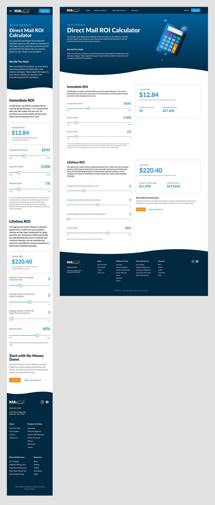

## About this project

Mail Shark is an industry leading direct mail and marketing company. The sales team at Mail Shark often uses return on investment calculations to explain why direct mail is a great marketing tool. This calculation not only takes into account the customer’s average sale and mailing quantity, but also an earned customer’s retention rate and referrals. This extra calculation is effective at convincing customers to enroll in a mailing campaign.

Previously, this ROI calculation was done behind the scenes with a private spreadsheet, providing very little transparency to customers. In an effort to make this sales tool more accessible, I was tasked to create an online version of the ROI calculator targeted towards automotive shop owners.

## Planning

### Stakeholder meeting

The stakeholder meeting involved the Regional Vice President of Sales, the Vice President of Marketing, the Creative Director and myself. The purpose of this meeting was to discuss the goals, features, and tone of the project.

#### Goals

1. Allow the user to effortlessly calculate their potential direct mail ROI
2. Educate the user about the unseen long-term benefits of direct mail
3. Collect the user’s contact information for follow-up calls

### Wireframing

During the wireframing process, I brainstormed low fidelity features that could accomplish and solve all the goals we discussed in the stakeholder meeting.

#### Allowing for easy calculations

After doing some research, I decided that range sliders would be the best method for allowing users to provide input. These are some of the benefits of using range sliders:

1. Sliders allowed us (Mail Shark) to control the range of input. This was important because allowing extremely large or small numbers would result in an unrealistic or negative output, which could discredit the calculator. 
2. Input sliders are mobile friendly. This experience was designed in a mobile-first fashion.
3. Dragging an input slider would trigger calculations on each increment. This was engaging for users and incentivized playing with the inputs.

#### Educating the user

There were two parts of the ROI calculation that the sales team used to acquire customers. There was the first step, immediate ROI, and the second step, lifetime ROI.

Immediate ROI is simply multiplying new customers by the customer’s average sales number and then dividing by the cost of the mailing campaign. This is a typical ROI calculation that many businesses use to weigh the value of an investment. 

Mail Shark used the second calculation, lifetime ROI, to really drive home the value of using direct mail to acquire new customers. This calculation, which is normally ignored or forgotten about, accounts for referrals that new customers make throughout their life and the amount of years they continue to use an auto shop’s services.

It was important to separate the calculations into different sections so the user could understand the difference and the added benefits of lifetime ROI compared to immediate ROI.

#### Collecting users info

At the bottom of the page, the call-to-action section not only offers a ‘sign up’ button, but also an ‘email me results’ button. By choosing the ‘Email Me Results’ button, the user would fill in their email address and be mailed their unique ROI calculation in a spreadsheet. This option requires less commitment than signing up on the spot and would entice users to provide their email address for future follow-ups.

## Prototyping the design

My preferred prototyping software is Adobe XD. I used this software to design the prototype.

## Developing for practice

After the prototype was approved for development, I worked with Mail Shark’s front-end developer to supply assets and aid development. 

Although, as UI/UX Designer, I was not responsible for developing this project, I coded the calculator independently as practice. Please checkout my code and my finished project.

### Technology used

- React
- CSS Modules
- Sass
- Numeral.js
- React-icons

## Testing

Before the production build of the calculator was launched, I conducted user testing to understand what users liked and didn't like about the design, interface, and overall experience. I was then able to incorporate the feedback into the project, which improved the overall experience.

### What did users like?

1. Ease of use
2. Live calculations
3. Wave animation in header

### What did users not like?

1. High sensitivity of the first slider
2. Undefined range

### Improvements after testing

At first, the calculator’s first input, average repair order, incremented by $1. This meant that there were 1800 steps in the range slider. During testing, it proved difficult for users to land on the exact number they wished to input. To fix this problem, we changed the slider to increment by $25, allowing for the user to more accurately adjust the input.

Before testing, the sliders did not display the range’s minimum and maximum values underneath. Users were unable to accurately guess the position of the value they desired to input. To fix this, we added small numbers underneath the sliders to indicate the range. 

## Final thoughts

The final direct mail ROI calculator is an effective sales tool. The experience successfully explains the long-term benefits of direct mail. The range sliders provided an intuitive way for users to input their unique values on both mobile devices and computer monitors.

I’m very satisfied with the final look of this project. The user interface is modern and takes advantage of user interaction (not text) to tell the desired story, direct mail is a great investment.

I enjoyed developing this project with React. Coding the range sliders was a great way to practice state management. Using the components I created for this interface, it would be simple to create ROI calculators in the future for different industries.
