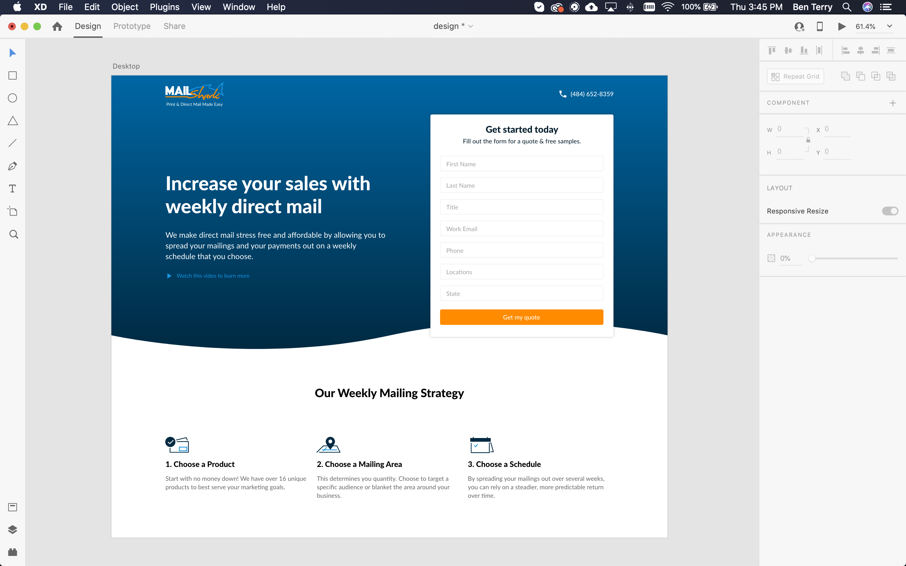
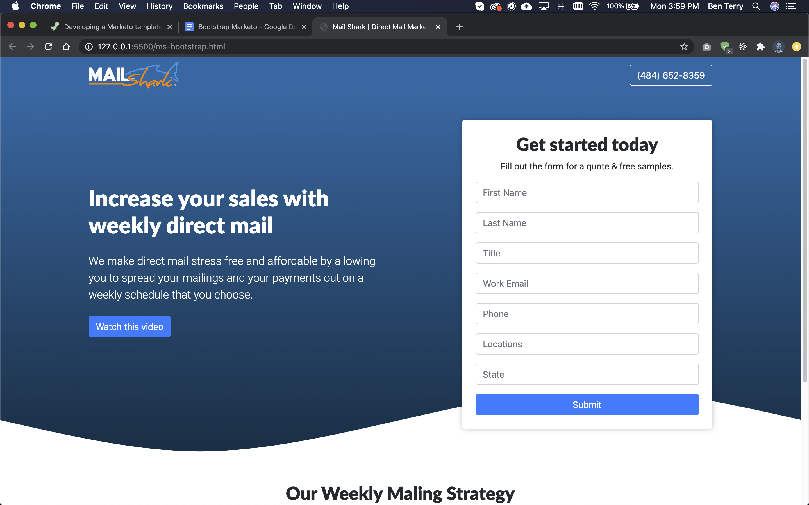
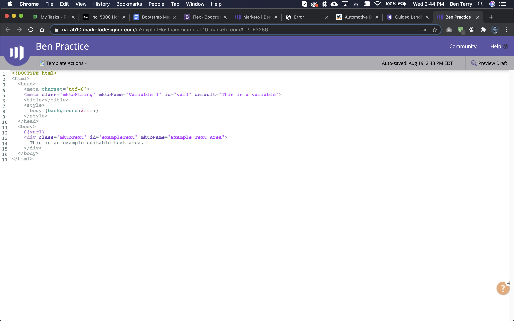
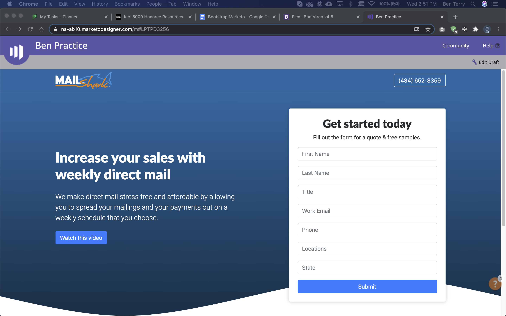
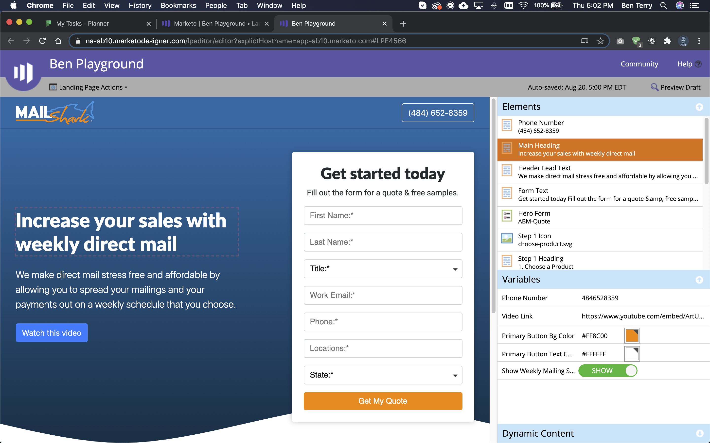
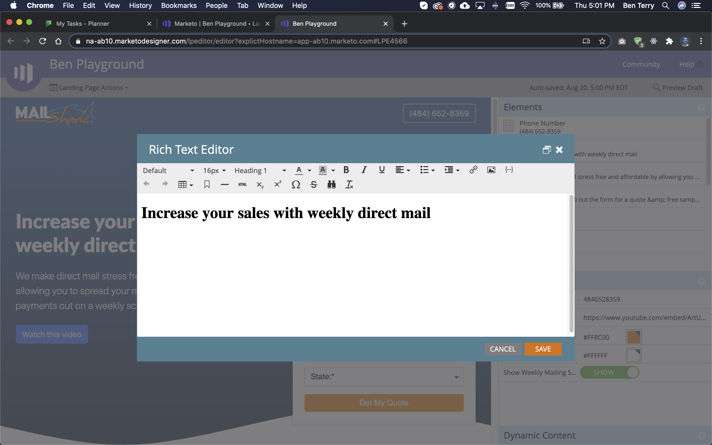

## Marketo guided templates

Marketo is an Adobe product. They provide services such as email marketing and lead management. At Mail Shark, the marketing department uses Marketo to build individualized landing pages to track response rates for direct mail campaigns. For example, if we were sending a piece of direct mail to a Marco’s Pizza franchise, the URL would be *themailshark.com/marcos* and lead to a landing page which would say, “Discounted pricing for Marco’s franchisees.” These landing pages also have unique analytic tools to help gauge the success of a campaign.

Guided templates in Marketo are pre-built landing pages with editable elements and variables. A team member without coding experience can easily create and customize a new landing page using a guided template.

As UI/UX Designer at Mail Shark, I often designed new guided templates, however, I wanted to learn the development process so I could implement better design patterns in the future.


### Why use Bootstrap?

This was my first experience using the Bootstrap CSS library. When I was first learning web development, I was told that I should first learn vanilla CSS, before using a framework, so I would better understand flexbox and grid. Now that I’m very comfortable with CSS, I was ready to see if Bootstrap, arguably the most well-known CSS library, would be helpful or a hindrance.

I thought this would be a good project to learn Bootstrap because Marketo guided templates are **only one** HTML file; any styling must be done inline and/or in a `<style>` tag in the `<head>` of the file. I expected that Bootstrap’s out-of-the-box utility classes may be handy to responsively style elements inline.

Also, these landing pages were usually expected to be developed quickly without much expectation of highly-custom components. Again, a great reason to use Bootstrap!

## Designing a Demo

The demo I designed included two sections; the hero area and Mail Shark’s Weekly Mailing Strategy. 
I wanted to practice importing Marketo forms, which are important for lead generation, so I included a form in the hero section. I also wanted to experiment with a slightly more complex Bootstrap component, so I added a call-to-action button in the hero area to trigger a video modal.

The Weekly Mailing Strategy section would allow me to practice using Bootstrap’s grid system.



## Learning Bootstrap and creating a local prototype

Guided templates must be written in Marketo’s online code editor, however, the editor is not very feature-rich. To have access to live-server development and auto-completion, I decided to write the HTML in my local development space and planned to copy the code over to the online editor when complete.

### Getting started

Bootstrap provides a great starter template in their documentation.

```html
<!doctype html>
<html lang="en">
    <head>
        <!-- Required meta tags -->
        <meta charset="utf-8">
        <meta name="viewport" content="width=device-width, initial-scale=1, shrink-to-fit=no">

        <!-- Bootstrap CSS -->
        <link rel="stylesheet" href="https://stackpath.bootstrapcdn.com/bootstrap/4.5.2/css/bootstrap.min.css" integrity="sha384-JcKb8q3iqJ61gNV9KGb8thSsNjpSL0n8PARn9HuZOnIxN0hoP+VmmDGMN5t9UJ0Z" crossorigin="anonymous">

        <title>Hello, world!</title>
    </head>
    <body>
        <h1>Hello, world!</h1>

        <!-- Optional JavaScript -->
        <!-- jQuery first, then Popper.js, then Bootstrap JS -->
        <script src="https://code.jquery.com/jquery-3.5.1.slim.min.js" integrity="sha384-DfXdz2htPH0lsSSs5nCTpuj/zy4C+OGpamoFVy38MVBnE+IbbVYUew+OrCXaRkfj" crossorigin="anonymous"></script>
        <script src="https://cdn.jsdelivr.net/npm/popper.js@1.16.1/dist/umd/popper.min.js" integrity="sha384-9/reFTGAW83EW2RDu2S0VKaIzap3H66lZH81PoYlFhbGU+6BZp6G7niu735Sk7lN" crossorigin="anonymous"></script>
        <script src="https://stackpath.bootstrapcdn.com/bootstrap/4.5.2/js/bootstrap.min.js" integrity="sha384-B4gt1jrGC7Jh4AgTPSdUtOBvfO8shuf57BaghqFfPlYxofvL8/KUEfYiJOMMV+rV" crossorigin="anonymous"></script>
    </body>
</html>
```

### 12-column system

I found Bootstrap’s powerful grid system very helpful when creating both sections. By creating a container, row, and columns, I was able to effortlessly attain the responsiveness I required for this design.

```html
<!-- Hero section -->
<header class="mb-3 pt-5 py-md-5">
    <div class="container"> 
        <div class="row align-items-center justify-content-between">
            <div class="col-md-6 text-white mb-5 mb-md-0 mt-md-n5">
                <h1>Increase your sales with weekly direct mail</h1>
                <p class="lead my-4">We make direct mail stress free and affordable by allowing you to spread your mailings and your payments out on a weekly schedule that you choose.</p>
                <button type="button" class="btn btn-primary" data-toggle="modal" data-target="#exampleModal">Watch this video</button>
            </div>
            <div class="col-md-6 col-lg-5 text-center">
                <div class="ms-form-wrapper p-4">
                    <h2>Get started today</h2>
                    <p>Fill out the form for a quote & free samples.</p>
                    <form>
                        <!-- Form here -->
                    </form>
                </div>
            </div>
        </div>
    </div>
</header>
```

```html
<!-- Weekly mailing steps -->
<section class="container my-3 mb-md-5">
    <div class="text-center my-5">
        <h2>Our Weekly Maling Strategy</h2>
    </div>
    <div class="row">
        <div class="col-sm-6 col-lg-4 my-2">
            
            <h3>1. Choose a Product</h3>
            <p>Start with no money down! We have over 16 unique products to best serve your marketing goals.</p>
        </div>
        <div class="col-sm-6 col-lg-4 my-2">
            
            <h3>2. Choose a Mailing Area</h3>
            <p>This determines you quantity. Choose to target a specific audience or blanket the area around your business.</p>
        </div>
        <div class="col-sm-6 col-lg-4 my-2">
            
            <h3>3. Choose a Schedule</h3>
            <p>By spreading your mailings out over several weeks, you can rely on a steadier, more predictable return over time.</p>
        </div>
    </div>
</section>
```

### Using Bootstrap components

Bootstrap’s documentation contains great component demos. I simply copied their example code to my HTML document, changed some ids, and it worked perfectly. This process was extremely quick compared to writing the javascript for the modal from scratch.

```html
<!-- Modal -->
<div class="modal fade" id="exampleModal" tabindex="-1" aria-labelledby="exampleModalLabel" aria-hidden="true">
    <div class="modal-dialog modal-dialog-centered modal-lg">
    <div class="modal-content">
        <div class="modal-header">
            <h5 class="modal-title" id="exampleModalLabel">The Weekly Mail Strategy</h5>
            <button type="button" class="close" data-dismiss="modal" aria-label="Close">
                <span aria-hidden="true">&times;</span>
            </button>
        </div>
        <div class="modal-body video-wrapper">
            <!-- youtube video -->
            <iframe width="560" height="315" src="https://www.youtube.com/embed/ArtUN9RAVX4" frameborder="0" allow="accelerometer; autoplay; encrypted-media; gyroscope; picture-in-picture" allowfullscreen></iframe>
        </div>
    </div>
    </div>
</div>
```

#### Video bug

While testing, I noticed the modal video continued to play after the model was closed. After some research and troubleshooting, I came across this solution, which I adapted to my modal.

```html
<script>
    $(document).ready(function(){
        /* Get YouTube video url and store it in a variable */
        var url = $("#videoPlayer").attr('src')

        /* Assign empty url value to the iframe src attribute when modal hide, which stop the video playing */
        $("#videoModal").on('hide.bs.modal', function(){
            $("#videoPlayer").attr('src', '')
        })

        /* Assign the initially stored url back to the iframe when modal is displayed again */
        $("#videoModal").on('show.bs.modal', function(){
            $("#videoPlayer").attr('src', url)
        })
    })
</script>
```

### Utility classes

Maybe you noticed in the code above, I really enjoyed the padding and margin utilities made available by Bootstrap. These classes made adding spacing to elements inline very simple. The naming convention is very intuitive.

## Completing the static prototype

Using Bootstrap made the HTML short and easy to read. Each section averaged 25 lines of code. No media queries were needed because Bootstrap handled all the responsiveness behind the scenes.

<LinkOutButton url="https://github.com/beterry/ms-bootstrap">View Github Repo</LinkOutButton>



## Creating Marketo template

When I created a new guided template in Marketo, the starting code included some examples about how to create editable elements and variables.



I copied my local HTML to the online editor and it looked correct!



### Making content editable

In Marketo, there are a few different elements that a developer can make editable. 

The most useful editable element is Text. The children of an HTML element with the class `mktoTxt` are editable via a rich text editor. The attribute `mktoName` is what the editable element is called in the template editor.

```html
<!-- These attributes make the contents editable -->
<div
    class="mktoText"
    id="mainHeading"
    mktoName="Main Heading"
>
    <h1>Increase your sales with weekly direct mail</h1>
</div>
```

After I added these attributes to this element, a team member would have the ability to edit the main heading.





The other useful editable element is Image. I gave the `<div>` parent of the icon `` the class of `mktoImg`. This made the icons within editable.

```html
<div class="mb-3 d-flex align-items-center" style="height:50px;">
    
</div>
```

#### Only make `<div>`'s editable

I originally was trying to put the class `mktoTxt` directly on the `<h1>` and `<p>` elements. When I inspected the code that the template produced, I found that this technique caused some styling issues. For better results, I wrapped the once naked elements in `<div>` tags and gave the parent the class of `mktoTxt`.

### Creating variables

In guided templates, variables are used to change CSS properties. For my demo design, I wanted to create 5 variables:

1. Phone number in the navigation
2. URL to Youtube video
3. Form button color
4. Form button text color
5. Toggle to show or hide Weekly Mailing Section

```html
<meta class="mktoString" mktoName="Phone Number" id="phoneNumber" default="4846528359">
<meta class="mktoString" mktoName="Video Link" id="videoLink" default="https://www.youtube.com/embed/ArtUN9RAVX4">
<meta class="mktoBoolean" id="showWeeklySteps" mktoname="Show Weekly Mailing Steps?" default="true" true_value="block" false_value="none" false_value_name="Hide" true_value_name="Show">
<meta class="mktoColor" id="primaryButtonBgColor" mktoname="Primary Button Bg Color" default="#ff8c00"> 
<meta class="mktoColor" id="primaryButtonTextColor" mktoname="Primary Button Text Color" default="#ffffff">
```

```html
<style>
    /* section can be toggled via variable */
    .mailing-steps{
    display: ${showWeeklySteps};
    }
</style>
```

```html
<!-- href attribute reads variable -->
<a
    class="btn btn-outline-light my-2 mktoText"
    id="phoneNumberLink"
    mktoName="Phone Number"
    href="tel:${phoneNumber}"
>
    (484) 652-8359
</a>
```

### Challenges with forms

Instead of using the form that I created in the local space, I wanted Marketo to manage which form was being displayed in the hero section. To do this, I deleted the form element and replaced it with:

```html
<div id="hero-form" class="mktoForm" mktoname="Hero Form"></div>
```

In the landing page editor, I then had the ability to add a Marketo form to the section. Marketo forms are important to include because they have complex lead generation functionality.

Styling the form that was input into the `<div>` was quite challenging. Overwriting the styles that came standard with the Marketo form required much trial-and-error. Eventually, I was able to style the form much like Bootstrap’s forms.

```html
<style>      
    .mktoForm { max-width: 100%; font-size: 16px !important; }

    .mktoForm fieldset { border: none !important; margin: 0 !important; }

    .mktoForm .mktoFieldWrap { width: 100% !important; }  
    .mktoForm .mktoFormRow label { font-weight: normal !important; width: 100% !important; padding: 0 !important; }

    .mktoForm .mktoFormRow fieldset {
        width: 100% !important;
        padding: 0 !important;
    }

    .mktoForm .mktoButtonRow { width: 100%; }
    .mktoForm .mktoButtonWrap { margin-left: 0 !important; }  
    .mktoForm .mktoButtonWrap .mktoButton {
        border-radius: .25rem !important;
        color: ${primaryButtonTextColor} !important;
        border: none !important;
        padding: .375rem .75rem !important;
        font-size: 1rem !important;
        background: ${primaryButtonBgColor} none !important;
        text-transform: capitalize !important;
        box-shadow: none !important;
        width: 100%;		
    }
</style>
```

### Approve page

After I was completely happy with the look and functionality of the landing page, I approved the edits in Marketo. You can view the final page here:

<LinkOutButton url="https://go.themailshark.com/ben-playground.html">View Live Marketo Page</LinkOutButton>

## Final thoughts

### Bootstrap

I enjoyed using Bootstrap to bootstrap this project. There is a reason the Bootstrap 12-column grid is so famous: it’s effortless to create highly responsive web pages without writing one media query. One of my goals for this experiment was to write as few lines of CSS as possible. I think Bootstrap really helped me achieve this goal. 

I think for a project like this one, where the designs aren't extremely customized and the deadlines are short, Bootstrap really shines!

### Marketo guided templates

Overall, it was very easy to create a Marketo guided template from an existing HTML document. Their <LinkOut url="https://docs.marketo.com/display/public/DOCS/Create+a+Guided+Landing+Page+Template">documentaion</LinkOut> is fairly minimal, so it took some experimenting to understand certain aspects of creating editable elements (like my problem with the `<div>`’s). It will take some more practice to be able to develop larger landing pages.

Importing the Marketo form and having to overwrite all the styles was not fun. My wish is that they would be less opinionated.

These landing pages are also fairly bloated. When I open the dev tools...it’s a nightmare. HA!

This practice was beneficial. I have a clearer picture of the development process behind creating guided templates. I will use this information to better suit my designs to Marketo’s guided templates.