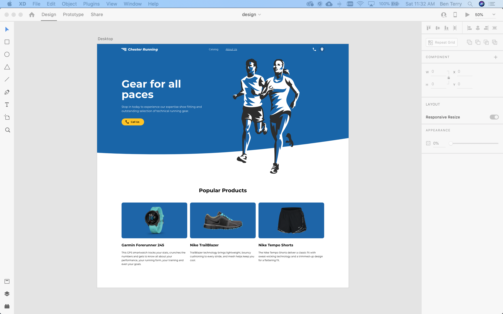
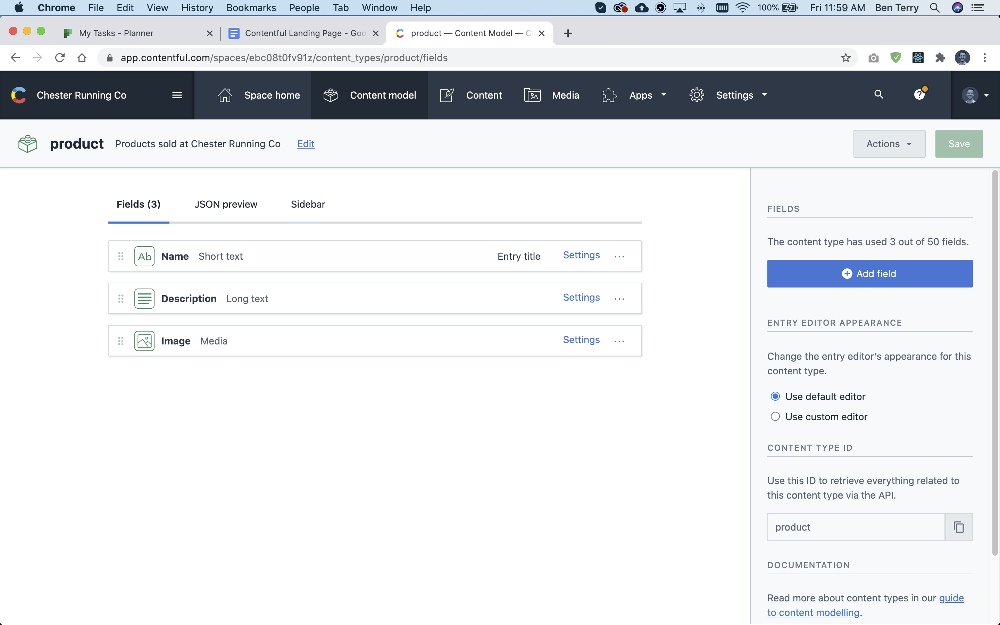
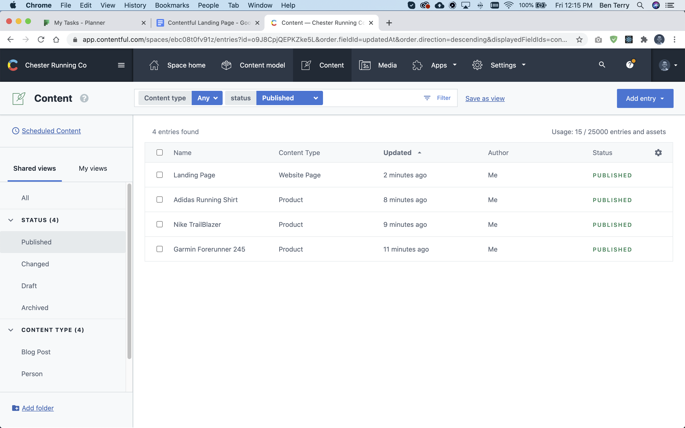
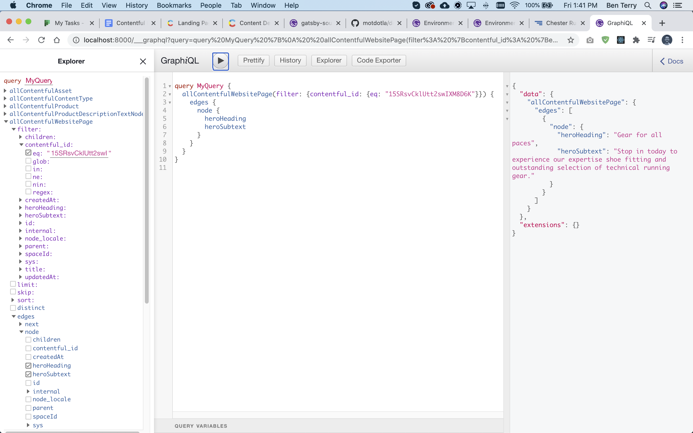
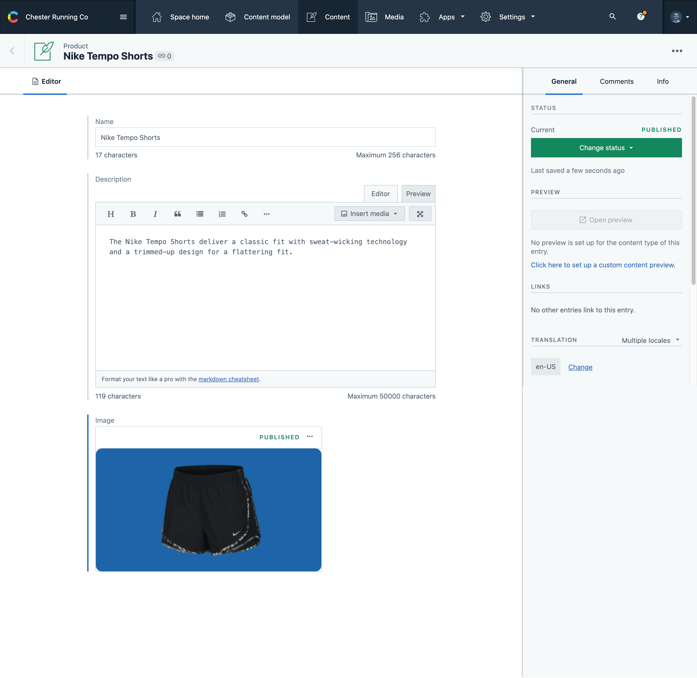
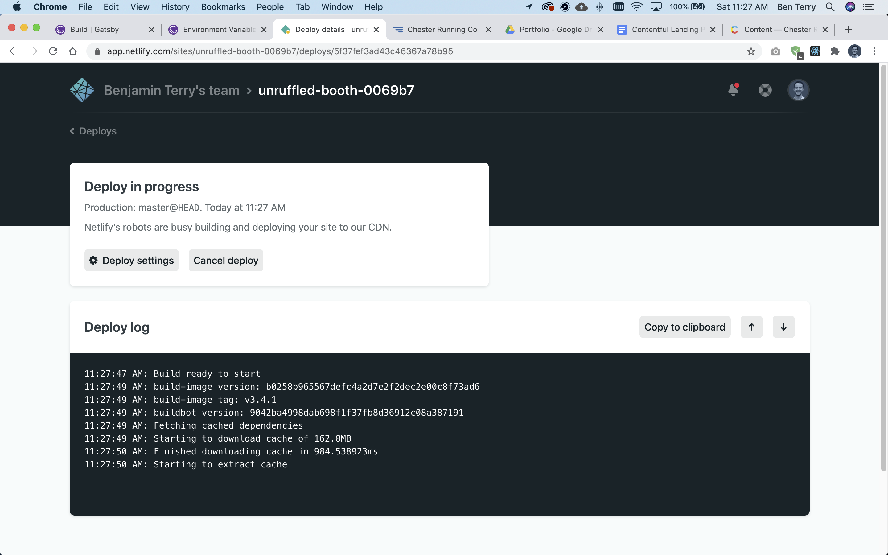

## Why I’m interested in Contentful

Contentful is a “headless” content management system (CMS). This refers to chopping the head (front-end) off the body (back-end) of a traditional CMS like Wordpress. Contentful simply stores and delivers content via a RESTful API which can be used by any tech-stack and on any device.

I was introduced to Contentful by the GatsbyJS documentation. I love using Gatsby to build static websites. This portfolio is built with Gatsby. While building personal projects with Gatsby, I wondered what would be the best way to allow a client to manage a Gatsby website after it was developed. It’s important to allow business owners the ability to edit content on a site without phoning a developer.

Using Contentful’s back-end services sounded like a great way to allow a future client to easily manage website content while giving me (the developer) the ability to build blazing fast, highly-custom sites with Gatsby, the framework I love.

### What’s the goal of this experiment?

1. Create a Contentful back-end to store content
2. Read the content from Contentful into a Gatsby site
3. Deploy the site and then edit the content to understand the workflow

I ultimately aimed to understand if Contentful would be a good way for business owners to add and update content on a Gatsby site without involving a developer.

## Design a demo

For this experiment, I designed a small website section for Chester Running (a fake small business that sells running equipment). I wanted to design a section in the demo that would be edited/updated regularly. In this scenario, the client would be able to go to their Contentful back-end and update what products are in the Popular Products section of this page.


<p class='caption'>The design mockup that I created in Adobe XD.</p>

## Develop static prototype

### Bootstrap project with Gatsby CLI

I created the project using Gatsby’s CLI and the gatsby-starter-hello-world starter theme. I prefer using the most bare-bones starter because I enjoy beginning with a blank project and no pre-made pages and components to delete.

### Develop components

Gatsby is based on React. I created 3 components:

1. Hero
2. Navigation
3. Popular Product

The components were styled with CSS modules.

#### Static data

As a placeholder for the information I would eventually source from Contentful, I used static strings and object arrays to develop the prototype.

```js
//TODO: replace this data with data from Contentful
const products = [
    {
        name: 'Garmin Forerunner 245',
        copy: 'This GPS smartwatch tracks your stats, crunches the numbers and gets to know all about your performance, your running form, your training and even your goals.',
        image: product1
    },
    {
        name: 'Nike TrailBlazer',
        copy: 'TrailBlazer technology brings lightweight, bouncy cushioning to every stride, and mesh helps keep you cool.',
        image: product2
    },
    {
        name: 'Adidas Running Shirt',
        copy: 'With this running shirt for men sweat has no chance even during intensive workouts. It’s made of lightweight, soft Climalite fabric that wicks sweat away from the skin for a comfortable, dry feel at any distance.',
        image: product3
    },
]
```

### Install Gatsby plugins

> Gatsby plugins are Node.js packages that implement Gatsby APIs. For larger, more complex sites, plugins let you modularize your site customizations into site-specific functionality.

Quote from <LinkOut url='https://www.gatsbyjs.com/docs/what-is-a-plugin/'>Gatsby Documentaion</LinkOut>


I installed a few plugins to add some functionality to the project:

1. Gatsby-plugin-manifest
2. Gatsby-plugin-google-fonts
3. Gatsby-plugin-react-helmet
4. Gatsby-transformer-sharp
5. Gatsby-plugin-sharp

## Getting started with Contentful

1. Create account
2. Create a <LinkOut url='https://www.contentful.com/help/spaces-and-organizations/#what-are-spaces-and-organizations'>space</LinkOut>

## Create content models and first entries

Contentful has three main sections in the back-end user interface. 

### Upload media

This is where you can easily upload images. I uploaded my product images and “published” them.

### Create content models

Before I could add the product content, I had to first create the content models for my products. The model defines what content fields are expected for each product. In this scenario, the Product model had three fields:

1. Name (short text)
2. Description (long text)
3. Image (media)


<p class='caption'>The content model for the products.</p>

I also created a content model for the web page itself. This is where I could add the heading and subheading so the client could also change this through Contentful. The Website Page model had two fields: 

1. Heading (short text)
2. Subheading (short text)

### Create content

After the content models were created, I created the three Product entries and one Website Page entry.


<p class='caption'>Content entries in Contentful's dashboard.</p>

## Read content from API

After the content was created, it was time to query the data from Contentful and replace the static data in my prototype.

### Install Contentful plugin

Gatsby has a plugin which allows for data to be queried from Contentful.

```js
npm install --save gatsby-source-contentful
```

### Define environment variables

Contentful requires you to use an API key to access the content from your space. I did not want to expose the API key to source control, so I created a `.env` file to pass the key to the build process.

```js
CONTENTFUL_ACCESS_TOKEN=aha8f2s4s2b5n4zn2ufg8h4
```

### Configure plugin

Gatsby plugins are easily configurable in the `gatsby-config.js` file. The `gatsby-source-contentful` plugin requires two options to be set when reading data from the Delivery API:

1. Space ID
2. Access token

I previously set up these two private variables in `.env.development` and can access them using dotenv (which is installed with Gatsby by default).

```js
{
    resolve: `gatsby-source-contentful`,
    options: {
        spaceId: `ebc08t0fv91z`, //found in Contentful dashboard
        accessToken: process.env.CONTENTFUL_ACCESS_TOKEN,
    },
},
```

#### Delivery API

Contentful has a few different APIs. For reading data to websites, I used the read-only Delivery API, which is the most simple and straight-forward to use.

### Use GraphiQL to experiment with queries

Gatsby features a great tool to experiment with GraphQL queries called graphiQL. This tool is a graphical, interactive, in-browser GraphQL development environment. It’s available at http://localhost:8000/___graphql when Gatsby is run in development mode.

Using this tool, I experimented with composing different queries (made available by using `gatsby-source-contentful`) to achieve my desired result of exposing the content I created in Contentful’s back-end. 


<p class='caption'>An example of using graphiQL to query the Heading and Subtitle of the webpage.</p>

### Query the data

In `index.js`, I then added the page data query and logged the result to my console to check the result was correct.

```js
//I used graphiQL to understand what I was receiving from the API
export const pageQuery = graphql`
    query MyQuery {
        allContentfulWebsitePage(filter: {contentful_id: {eq: "15SRsvCklUtt2swIXM8D6K"}}) {
            edges {
                node {
                    heroHeading
                    heroSubtext
                }
            }
        }
        allContentfulProduct {
            edges {
                node {
                    name
                    description {
                        description
                    }
                    image {
                        fluid {
                            ...GatsbyContentfulFluid
                        }
                    }
                }
            }
        }
    }
`
```

### Create variable from the data

To make the query data easier to work with, I mapped the product data to a new array and destructured the heading and subheading.

```js
//map nodes from query data to a new array
const products = data.allContentfulProduct.edges.map(edge => edge.node)

//deconstruct heading and subheading from query data
const {heroHeading, heroSubtext} = data.allContentfulWebsitePage.edges[0].node
```

### Pass data to components

I then replaced the static data with the data I received from Contentful!

```js
<Hero 
    heading={heroHeading}
    copy={heroSubtext}
/>
<div className='container'>
    <h2 className='center-text mb-2'>Popular Products</h2>
    <ul className='popular-products mb-6'>
        {products.map((product, index) =>
            <PopularProduct
                name={product.name}
                description={product.description.description}
                image={product.image.fluid}
                key={index}
            />
        )}
    </ul>
</div>
```

<LinkOutButton url="https://github.com/beterry/contentful-lp">View Github Repo</LinkOutButton>

## Deploy to Netlify

After the project was running as expected in my local environment, it was time to deploy to Netlify. Netlify is an awesome web host that allows developers to connect a Github repository, build and deploy a project all in one place. It works really well with Gatsby.

### Set environment variables in Netlify

The project failed to build the first time because my API was undefined.

Because I used an environment variable to pass my Contentful API key to `gatsby-config.js` in my local development environment, the key was not in my Github repo, and therefore, not available to Netlify. To make sure Netlify had access to the API key, I stored the variable in Netlify’s build & deploy settings, available in the new site’s settings.

### Deploy

After the API key was defined in Netlify’s environment variables, I triggered a new deploy and the site built and deployed flawlessly in about 30 seconds. Check it out:

<LinkOutButton url="https://unruffled-booth-0069b7.netlify.app/">View Deployed Site</LinkOutButton>

## Test usability by changing content

After the site was successfully deployed, I wanted to experiment to see how easy it would be for my make-believe client to update the products being displayed on the site.

### Add new product

In Contentful’s back-end, I uploaded a new product image, created a new product entry (where I defined the product's name and description), and then published the new entry.


<p class='caption'>Adding a new product in Contentful's backend.</p>

### Unpublish old product

To prevent the old product from being displayed on the page, I unpublished the entry.

### Deploy site

After my content in Contentful was up-to-date, I navigated back to Netlify and triggered a deploy. The site re-built itself and the new product displayed on the site.


<p class='caption'>Deploying to Netlify</p>

## Final thoughts

I really enjoyed working with Contentful. Combining Gatsby’s performance with Contentful’s easy-to-use, intuitive back-end CMS is a great way to develop fast websites that are also editable by the client.

Installing and configuring the gatsby-source-contentful plugin was very simple and immediately made available all the content I needed from Contentful. Querying the data and re-mapping the array to easier-to-use variables was an efficient way to get props to components and render the data.

I found Contentful’s user interface extremely user-friendly and easy to use. A client would, no doubt, enjoy using this back-end to manage their content. Content models, created by a developer, would make adding and editing content very intuitive.

I will definitely use Contentful in the future to create back-ends for static websites.