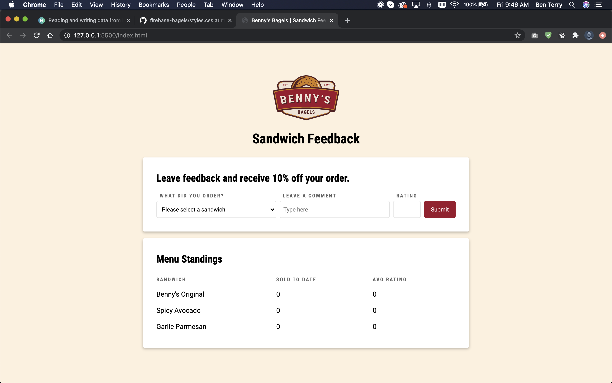

## About this experiment

### What is Firebase?

Firebase is a suite of application development services provided by Google. These services include: 

- Cloud Firestore (NoSQL database)
- Authentication
- Hosting
- Cloud Storage
- Analytics
- And much more…

Google describes these services as a cohesive platform which allows for developers to easily manage infrastructure and focus on building great user experiences. 

### Cloud Firestore

For this experiment, I was interested in learning about reading and writing data from Cloud Firestore. 

Firestore is a NoSQL database which supports real-time data fetching and an easy-to-use data browsing tool. NoSQL (non-relational) means that instead of organizing data into a table, data is organized in key-value pairs. NoSQL databases have no predefined structure so developers can organize data however is most efficient for the front-end application.

### Goals

1. Create a Firestore database
2. Link the database to a simple application
3. Read and display data from the Firestore
4. Save data to the Firestore

## Designing the interface

Based on my goals for the project, I designed an interface that included a simple form and table. The form would allow a user to submit data and the table would display the aggregated data from the Firestore.

Benny’s Bagels is my fictional cafe where I sell 3 variations of my delicious bagel sandwich. For this experiment, I designed a webpage where my customers can leave a comment and a rating for any variation of sandwich. The table displays the average rating and total number sold of each sandwich. 


<p class="caption">I used Adobe XD to design the interface I intended to develop</p>

## Setting up my documents

I created 3 project files: `index.html`, `styles.css`, and `app.js`. I added both the stylesheet and javascript to the HTML file and coded the markup.

```html
<!-- Form for submitting feedback-->
<div class="container">
    <h2>Leave feedback and receive 10% off your order.</h2>
    <form id="rating-form">

        <div class="grow">
            <label for="sandwich">What did you order?</label>
            <select name="sandwich" id="sandwich" required>
                <option value="">Please select a sandwich</option>
                <option value="original">Benny's Original</option>
                <option value="spicy">Spicy Avocado</option>
                <option value="garlic">Garlic Parmesan</option>
            </select>
        </div>

        <div class="grow">
            <label for="comment">Leave a comment</label>
            <input class="w-100" type="text" name="comment" id="comment" placeholder="Type here">
        </div>
        
        <div>
            <label for="rating">Rating</label>
            <input type="number" id="rating" name="rating" min="1" max="5" required>
        </div>
        
        <button>Submit</button>

    </form>
</div>
```

```html
<!-- Table for displaying data -->
<div class="container">
    <h2>Menu Standings</h2>
    <table>
        <thead>
            <tr>
                <th>Sandwich</th>
                <th>Sold to Date</th>
                <th>Avg Rating</th>
            </tr>
        </thead>
        <!-- Populated by app.js -->
        <tbody id="menu-table"></tbody>
    </table>
</div>
```

### Rendering table rows
The table body’s rows were injected into the DOM by `app.js`. I created a local variable to act as a placeholder for the eventual data I would read from the Firestore. The `updateTable()` function used this local data to create rows and add them to the table body.

```js
//local data
let feedback = {
    original: {
        total: 0,
        rating: 0,
    },
    spicy: {
        total: 0,
        rating: 0,
    },
    garlic: {
        total: 0,
        rating: 0,
    },
}

//clears and then renders the table rows
function updateTable(){
    menuTable.innerHTML = ""

    let original = createRow("Benny's Original", feedback.original.total, feedback.original.rating / feedback.original.total);
    let spicy = createRow("Spicy Avocado", feedback.spicy.total, feedback.spicy.rating / feedback.spicy.total);
    let garlic = createRow("Garlic Parmesan", feedback.garlic.total, feedback.garlic.rating / feedback.garlic.total);

    menuTable.appendChild(original)
    menuTable.appendChild(spicy)
    menuTable.appendChild(garlic)
}

//init table
updateTable()
```


<p class="caption">The static prototype ready for data from the Firestore</p>

## Creating a new Firebase project

After designing the experiment’s interface, the next step was to create a Firebase account and connect it to my front-end.

It was very simple to create a new project in the Firebase Console. I gave my project the name “firebase-bagels”, chose my region, and configured a few settings.


<p class="caption">The Firebase dashboard after I created the project</p>

### Add Firebase SDK

After the project was created, I had the ability to add the Firebase SDK to my web application. The Firebase dashboard provided a code snippet to paste into my project.

Once the Firebase SDK was added to the project, I added the Cloud Firestore libraries to my app so I could access the database. 

`<script src="https://www.gstatic.com/firebasejs/7.21.1/firebase-app.js"></script>`

`<script src="https://www.gstatic.com/firebasejs/7.21.1/firebase-firestore.js"></script>`

### Initialize Cloud Firestore

To get access to the database, I initialized an instance of Cloud Firestore below the SDK.

```html
<!-- the core Firebase JS SDK is always required and must be listed first -->
<script src="https://www.gstatic.com/firebasejs/7.21.1/firebase-app.js"></script>
<!-- allows me to initialize Firestore below -->
<script src="https://www.gstatic.com/firebasejs/7.21.1/firebase-firestore.js"></script>

<script>
    // my web app's Firebase configuration
    var firebaseConfig = {
        apiKey: "AIzaSyCJ8PREb4TB0awYiuHkcVit9qshP-_M",
        authDomain: "fir-bagels.firebaseapp.com",
        databaseURL: "https://fir-bagels.firebaseio.com",
        projectId: "fir-bagels",
        storageBucket: "fir-bagels.appspot.com",
        messagingSenderId: "172641506570",
        appId: "1:172641506570:web:9d29ff88c75076f111d6f3"
    };
    // initialize Firebase
    firebase.initializeApp(firebaseConfig);
    // creates a variable I can use in app.js to access the database
    var db = firebase.firestore();
</script>
```

## Reading data from the Firestore

Firestore supports reading data once or every time the database is changed. For this simple experiment, simply reading the data from the Firestore once when the page loads was sufficient.

First I manually created a collection and added one document to it from the Firebase Console.


<p class="caption">I manually added a collection and document to my new database</p>

I then added a function to `app.js` which queries all the documents in my collection (which was only 2) and outputs the data to the developer console in the browser. Awesome!

```js
// reads every document in the collection 'feedback' in the Firestore
db.collection('feedback').get().then((querySnapshot) => {
    // loops through every document and prints the data to the console
    querySnapshot.forEach((doc) => {
        console.log(doc.data())
    });
});
```


<p class="caption">Google Chrome's console after I added the function above</p>

After knowing that my interface was successfully connected to my front-end and I was able to read the data from Firestore, I wrote a javascript function to query Firebase, sort through the feedback documents, update the local feedback variable, and then re-render the table rows with the data from Firebase. When the page loaded, this function was called.

```js
// read data from firebase
function getFeedback(){
    db.collection('feedback').get().then((querySnapshot) => {
        querySnapshot.forEach((doc) => {
            feedback[doc.data().sandwich].rating += doc.data().rating
            feedback[doc.data().sandwich].total += 1
        });
        // after all the documents are sorted through, the table is updated with the correct values
        updateTable();
    });
}
```

## Saving data to the Firestore

Next, the form on the page needed to save the inputted data to the Firestore and update the table below. I added an event listener to the form which executed when the submit button was pressed. The event listener added a document to the database with the values of the form fields, updated the local feedback variable, cleared the form fields, and updated the table with the new data. 

```js
// save data on form submit
form.addEventListener('submit', (e) => {
    e.preventDefault();
    const sandwich = form.sandwich.value;
    const rating = parseInt(form.rating.value);

    // add a document to the collection 'feedback' with the values from the form
    db.collection('feedback').add({
        sandwich,
        comment: form.comment.value,
        rating,
    })
    .then(() => {
        console.log(`Saved to firebase...`); 
    });
    
    //update local data
    feedback[sandwich].total += 1;
    feedback[sandwich].rating += rating;
    updateTable();

    //clear fields after submit
    form.sandwich.value = '';
    form.comment.value = '';
    form.rating.value = '';
})
```

Notice, when the form is submitted, the database is not read again. The form simply adds the document to the database and updates the local feedback variable which is used to calculate the new values. This helped performance because all the documents in the database did not have to be looped over again!

Check out the finished experiment and leave a comment and rating for your favorite sandwich!

<LinkOutButton url="https://beterry.github.io/firebase-bagels/">Finished project</LinkOutButton>
<LinkOutButton url="https://github.com/beterry/firebase-bagels">View Github Repo</LinkOutButton>

## Final Thoughts

Firebase’s Cloud Firestore was much easier to use than I expected. Although the documentation was a little confusing at first, after a little experimentation, I found the process of reading and writing data to be effortless.

In the future, I look forward to experimenting with updating and deleting documents in the Firestore.