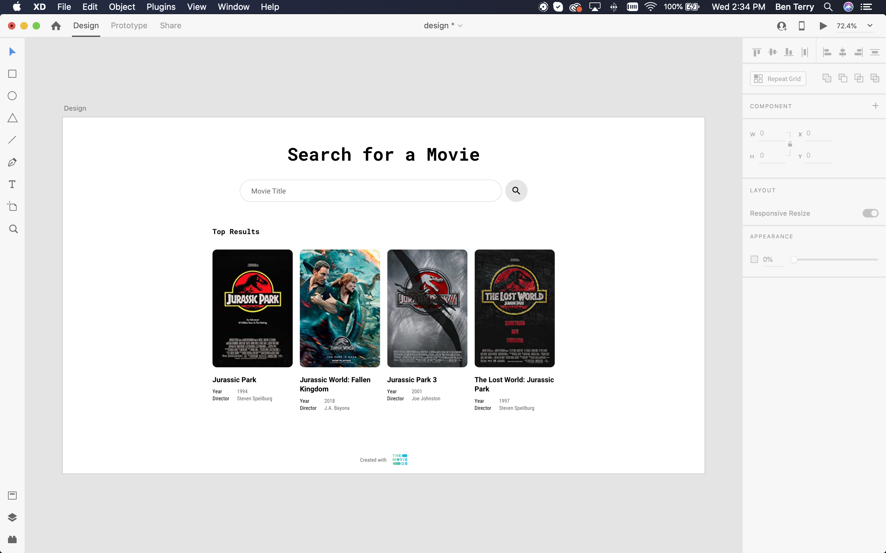
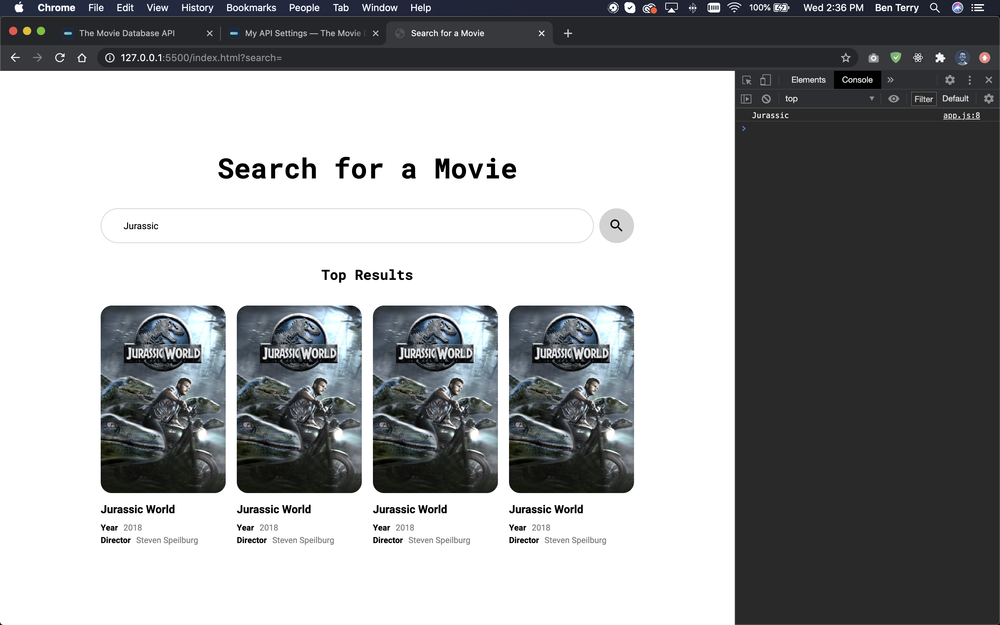

## About this project

I’m constantly striving to grow my skills as a developer and UI/UX designer. Although I’ve had experiences working with APIs before, I’ve never used a third party’s API outside a tutorial. To practice working with APIs, I wanted to `GET` data from an API using a popular javascript library called Axios.js and render the data to the screen.

### What is an API?

API is an acronym standing for Application Programming Interface. Simply put, API’s are a dedicated set of URLs that, when requested, return pure data.

### Why am I interested in Axios?

Axios is a popular javascript library used to make `XMLHttpRequest`’s from the browser. The library is very similar to the Fetch API, however it features simplified syntax and automatic JSON transforming.

### Goals

- Get data from a third-party API with Axios
- Render the data

## Designing the interface

I love film (I own over 200 DVDs) and thought interacting with a movie database API would be fun. Based on the goals of the experiment, I designed a simple movie searching interface to develop. I planned to query a movie API with a form submission and display the top 4 results.


<p class="caption">I used Adobe XD to design the simple movie searching interface</p>

## Exploring the API

Through Google searching, I found a free service called <LinkOut url="https://developers.themoviedb.org/3">The Movie Database API.</LinkOut> I registered as a developer and received an API key to use in my requests.

The API documentation was great. I was easily able to find instructions on how to search the database by movie title. This is an example URL searching for ‘Jack Reacher’:

`https://api.themoviedb.org/3/search/movie?api_key={api_key}&query=Jack+Reacher`

Knowing how the API worked allowed me to better plan how my front-end would function:

1. Submit form
2. Parse the submitted value and replace `_` with `+`
3. Combine my API key with the parsed value to create a legitimate URL
4. Request data from the URL with Axios
5. Add an element to the DOM for the first 4 results

## Getting started

### Writing the mark up

Before attempting to receive data from the API, I developed the front-end using static/fake data as a placeholder. `app.js` used a `for` loop to inject the same movie information repeatedly into the results list.

```html
<!DOCTYPE html>
<html lang="en">
<head>
    <meta charset="UTF-8">
    <meta name="viewport" content="width=device-width, initial-scale=1.0">
    <title>Search for a Movie</title>
    <link rel="stylesheet" href="styles.css">
</head>
<body>
    
    <section id="search-section">
        <h1>Search for a Movie</h1>
        <form id="search-form">
            <input type="text" id="search" name="search" placeholder="Movie title" required>
            <button>Search</button>
        </form>
    </section>

    <section>
        <h2 id="result-header"></h2>
        <ul id="results"></ul>
    </section>

    <script src="app.js"></script>
</body>
</html>
```

```js
const results = document.querySelector('#results')

let movieList = ''

//insert this movie component 4 times
for(let i = 0; i < 4; i++){
    movieList += `
        <li class="movie">
            
            <h3>Jurassic World</h3>
            <div class="movie-detail">
                <h4>Year</h4>
                <p>2018</p>
            </div>
            <div class="movie-detail">
                <h4>Director</h4>
                <p>Steven Speilburg</p>
            </div>
        </li>
    `;
}

results.innerHTML = movieList; 
```


<p class="caption">The same movie was inserted into the list as a placeholder</p>

### Installing Axios.js

After the front-end was developed, I installed Axios via CDN. I placed this line in `index.html` before `app.js`.

`<script src="https://unpkg.com/axios/dist/axios.min.js"></script>`

## Receiving and rendering data

### Parsing the input

To receive data from the API I needed to create a functional URL to request data from. To do this, I first needed to parse the value submitted by the form, replace `_` with `+`, and concatenate the new value onto the base URL (`https://api.themoviedb.org/3/search/movie`) and my API key. 

```js
form.addEventListener('submit', (e) => {
    e.preventDefault();
    searchFromUser = form.search.value;
    
    //format the string to use in URL
    //example: Jack Reacher -> jack+reacher
    searchFormatted = searchFromUser.replace(/\s+/g, '+').toLowerCase();
});
```

### Using Axios to perform a `GET` request

I passed this complete URL into `axios.get()` to receive data. 

Axios uses Promise syntax to handle asynchronous actions. Using `.then()`, I logged the response in my console after the request was successfully completed. Axios transformed the JSON data received from the API into an object with a `data.results` property containing an array of movie information.

```js
//request data from API
axios.get(`https://api.themoviedb.org/3/search/movie?api_key=${key}&query=${searchFormatted}`)
.then((res) => {
    console.log(res.data.results);
})
```

### Rendering the movies

I wrote a `renderMovies()` function that accepted an array of movie information, looped over the first 4 items, inserted the values into a template literal, and set the `innerHTML` of the results in the DOM.

I replaced `console.log(res.data.results)` with `renderMovies(res.data.results)` and the interface was completed! Check it out and search for your favorite movie!

<LinkOutButton url="https://beterry.github.io/movie-api/">Finished project</LinkOutButton>

```js
function renderMovies(movies){
    movieList = '';

    //loops through up to 4 items
    for(let i = 0; i < 4 && movies[i] != undefined; i++){
        const movie = movies[i];

        //variables for data
        const title = movie.title;
        const releaseDate = new Date(movie.release_date)
        const releaseYear =  releaseDate.getFullYear();
        const poster = movie.poster_path;

        //create URL for poster image or use placeholder
        let posterURL = '';
        if(poster){
            posterURL = `${imageURL}${poster}`;
        } else {
            posterURL = "https://critics.io/img/movies/poster-placeholder.png";
        }

        //movie component
        movieList += `
            <li class="movie">
                
                <div class="movie-details">
                    <p>${releaseYear}</p>
                    <h3>${title}</h3>
                </div>
            </li>
        `;
    }

    //inject components into DOM
    results.innerHTML = movieList;
    //reset form
    form.search.value = '';
}
```

## Final thoughts

I’m very happy with the outcome of this small project. The interface looks and works exactly how I planned.

Axios allowed for easy API calls because of the library’s simple syntax and automatic JSON transforming. The final HTML and javascript files, combined, were less than 100 lines of code!

This project was a great starting point for a larger, movie application I plan on developing in the future.
