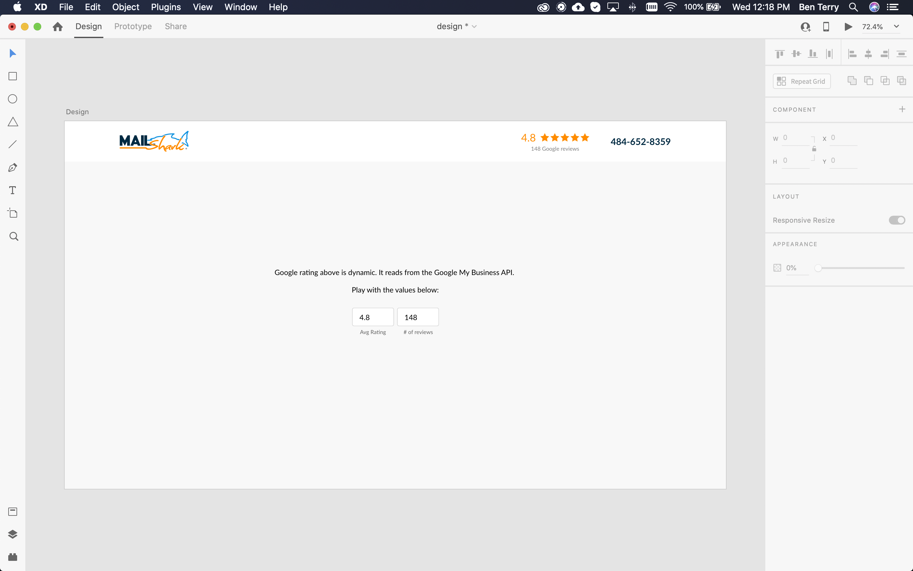
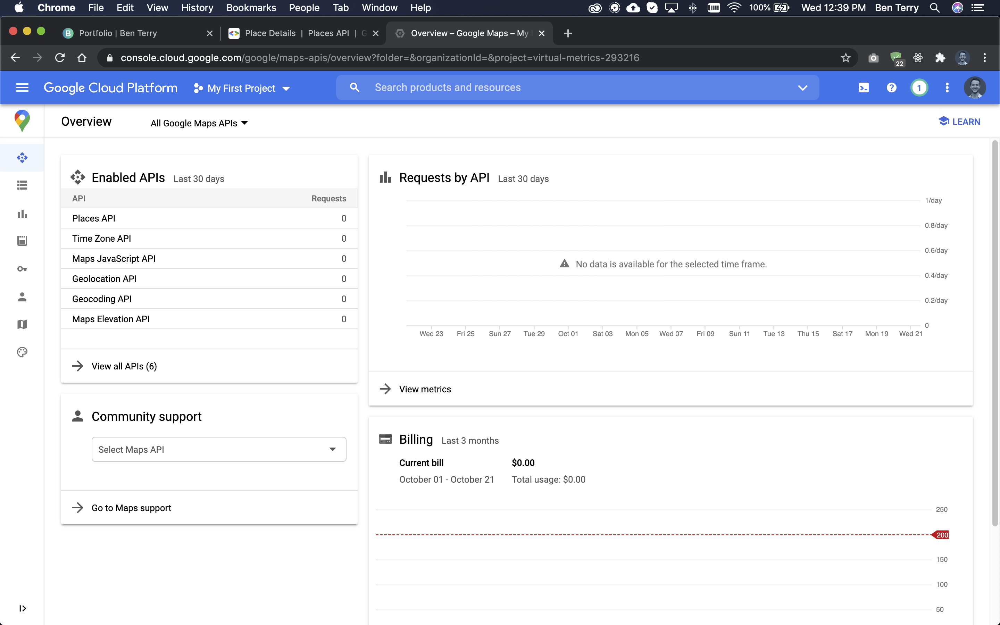
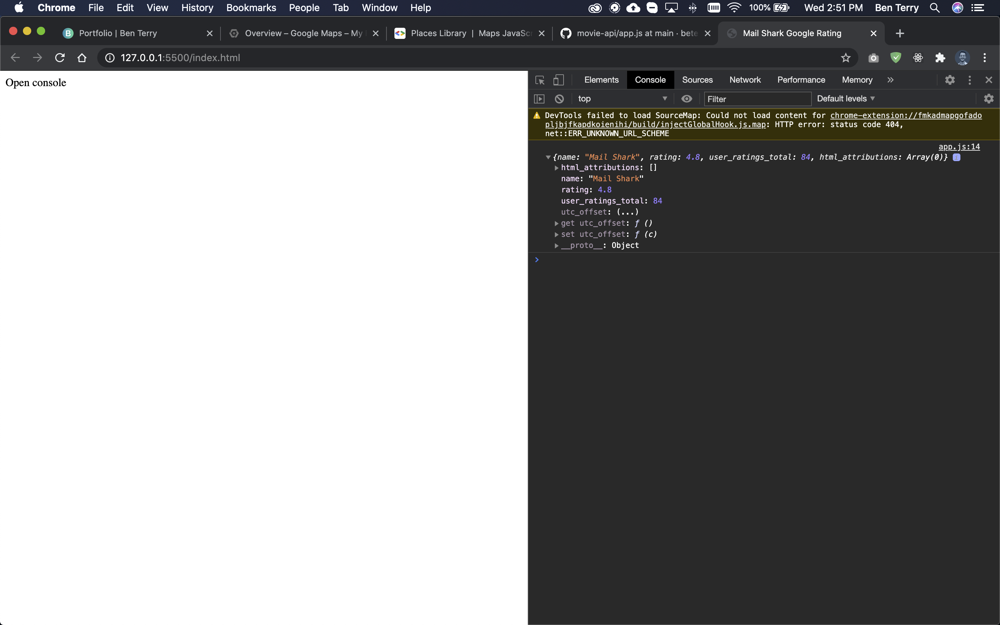
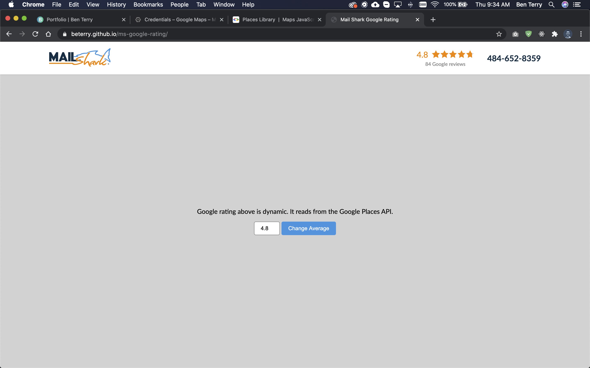

## About this exploration

At Mail Shark, we create custom landing pages for each company we target with custom advertisements. This technique is extremely effective but results in hundreds of landing pages existing from over 10 years of marketing. 

A few weeks ago, we were fortunate to have our average Google rating increase to 4.8. Because user reviews are a powerful trust indicator, we display this number on all of our landing pages. Updating the rating image on dozens of landing page templates was time-consuming.

To improve this process, I wanted to explore the option of having these ratings be dynamic, reading directly from Google. In this blog post, I’ll explain my exploration into using the Google Places API to read and render this data.

## Designing the navigation bar

To experiment with displaying our Google rating, I designed a simple navigation bar resembling the style Mail Shark uses on several landing pages. To easily test how the rating would respond to a dynamic number, I included an input in which I could quickly adjust and monitor the resulting output.


<p class="caption">I used Adobe XD to design the navigation bar</p>

## Writing the markup

Before exploring Google’s Places API, I developed a static interface with HTML and CSS. 

```html
<body>
    <nav>
        <div class="nav_inner">
            <div class="nav_inner__left">
                
            </div>
            <div class="nav_inner__right">
                <div class="nav_rating">
                    <!-- the innerHTML of this element is changed when data is returned by the API -->
                    <div class="nav_rating__top">
                        <p>1.0</p>
                        
                        
                        
                        
                        
                    </div>
                    <div class="nav_rating__bottom">
                        <p id="numberOfReviews">1 Google reviews</p>
                    </div>
                </div>  
                <p class="nav_phone">484-652-8359</p>
            </div>
        </div>
    </nav>
    <main>
        <p>Google rating above is dynamic. It reads from the Google Places API.</p>
        <form id="form">
            <input type="number" step=".1" min="1.0" max="5.0" value="1.0" id="newRating" name="newRating">
            <button>Change Average</button>
        </form>
    </main>
</body>
```

## Getting started with Google Places API

Google’s Places API is part of the larger Google Maps Platform. The API has real-time location data on over 200 million locations worldwide.

### Creating a Google Maps Platform account

To get started with Google's Places API, I first had to make a Google Cloud Platform account. This process involved accepting some terms and conditions and providing payment information in case my usage exceeded the free-to-use amount (1,000 requests per day). After signing up, it automatically created a new project, “My First Project.”


<p class="caption">The Google Maps Platform console.</p>

### Enable API

Every request to Google’s Places API requires an API key. To receive this key, I had to enable the Places API in the Google Cloud Console. After the API was enabled, I was able to find my key in the Credentials tab.

### Add restrictions to API key

Applying API restrictions to your key limits usage. This is important because my payment information is attached to the key and the key is exposed in the client-side code. To prevent someone from using my key in nefarious ways, I placed a restriction on it, allowing it to only be used by the Places API and from the demo's URL.

## Using the Maps Javascript API

I was then ready to begin reading data from the API.

### Loading the library

To use the Google Places API in client-side code, I added this script to my HTML document. I also created a blank javascript file and added it to the document.

```html
<!-- load the Google Places API -->
<script type ="text/javascript" src="https://maps.googleapis.com/maps/api/js?key={key}&libraries=places"></script>

<!-- load custom js -->
<script type ="text/javascript" src="app.js"></script>
```

### Finding Mail Shark’s ID

To query for Mail Shark’s details, I was required to know it’s `placeId`. I used this <LinkOut url="https://developers.google.com/maps/documentation/javascript/examples/places-placeid-finder">Place ID Finder</LinkOut> to discover Mail Shark’s ID.

In `app.js`, I created this request variable containing Mail Shark’s `placeId` and what information I wanted to receive from the API.

```js
var request = {
    placeId: 'ChIJ_8ZbJhFuxokRqvSite8h_Vo',
    fields: ['name', 'rating', 'user_ratings_total']
};
```

### Getting the details

To receive information from the API, I called the `getDeatils()` method with the request containing Mail Shark’s `placeId`. This method also accepted a callback method that handled the asynchronous response. In this callback, I logged the response to my console to view the resulting data.

```js
var service = new google.maps.places.PlacesService(dataContainer);
service.getDetails(request, callback);

// log data to console
function callback(place, status) {
    console.log(place);
}
```

I received Mail Shark’s rating and the number of reviews the rating was based upon. Perfect!


<p class="caption">Mail Shark's rating and number of reviews in my developer console</p>

## Rendering place details to the screen 

To render the information I received from the API, I wrote two javascript functions.

```js
const numberContainer = document.querySelector('#numberOfReviews');
const addStarsToo = document.querySelector('.nav_rating__top');

//render the rating by-line
function renderNumberOfReviews(numberOfReviews){
    numberContainer.textContent = `${numberOfReviews} Google reviews`;   
}

//creates HTML and injects the stars into the navigation bar
function renderStars(rating){
    const numberOfStars = Math.floor(rating);
    const fractionStar = rating % 1;

    // this string of HTML is injected into the DOM
    // it begins with the rating parameter
    let stars = `<p>${rating}</p>`

    // add whole stars to string
    for (let i = 0; i < numberOfStars; i++){
        stars += ``
    }

    // add fractional stars to the string
    if (numberOfStars < 5){
        if (fractionStar == 0){
            stars += ``
        } else if (fractionStar > 0 && fractionStar <= .3){
            stars += ``
        } else if (fractionStar > .3 && fractionStar <= .6){
            stars += ``
        } else if (fractionStar > .6 && fractionStar <= .85){
            stars += ``
        } else {
            stars += ``
        }
    }

    // add gray stars to the string
    const grayStars = 4 - numberOfStars;
    if (grayStars > 0){
        for (let i = 0; i < grayStars; i++){
            stars += ``
        }
    }
    
    // inject HTML into DOM
    addStarsToo.innerHTML = stars;
    form.newRating.value = rating;
}
```

Instead of logging the response to my console, I passed the data into these functions which rendered the rating number, corresponding stars, and the number of reviewers.

```js
// pass the data to render functions
function callback(place, status) {
    renderStars(place.rating);
    renderNumberOfReviews(place.user_ratings_total);
}
```


<p class="caption">Screenshot of the final interface</p>

Check it out:

<LinkOutButton url="https://beterry.github.io/ms-google-rating/">Finished project</LinkOutButton>
<LinkOutButton url="https://github.com/beterry/ms-google-rating">Github code</LinkOutButton>

## Final thoughts

I think reading and rendering Mail Shark’s Google rating to landing pages in this way would be convenient because the marketing team would never have to update the rating, it would update automatically every time the page is loaded.

There is one problem, however. Google allows for 1,000 calls to the Places API per day. If that limit is reached, Google charges a fractional cent per additional call. Every time a landing page is visited, the page makes a call to the API. This means, depending on the number of visitors per day to Mail Shark’s landing pages, this convenient option could accrue a cost.

However, Mail Shark pays their employees to update these pages every time the rating is updated. Arguably, these wages are a higher cost compared to the possibility of being changed a few cents per day if the API limit is reached.

I look forward to bringing this solution to my team!