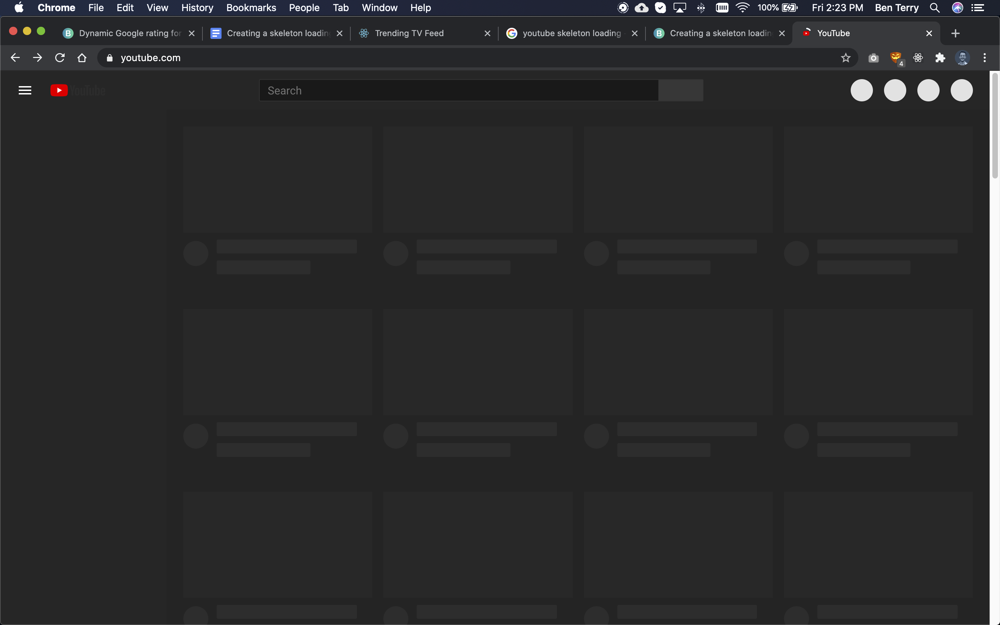
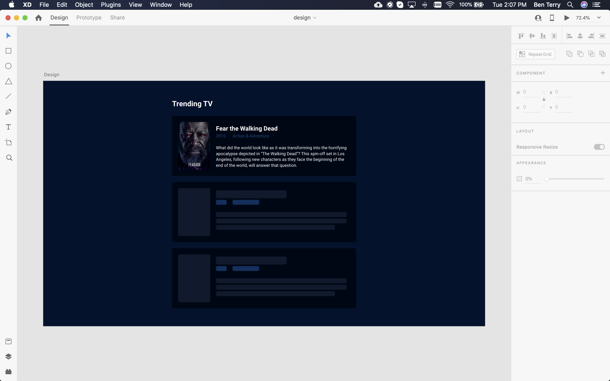
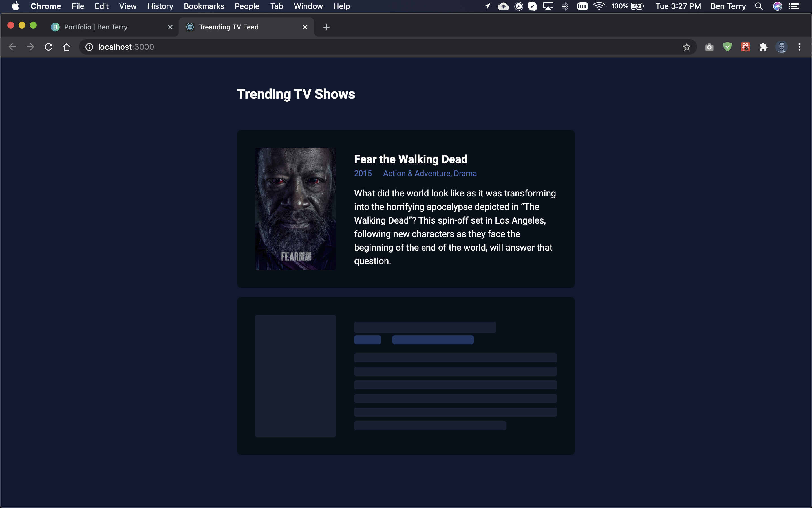
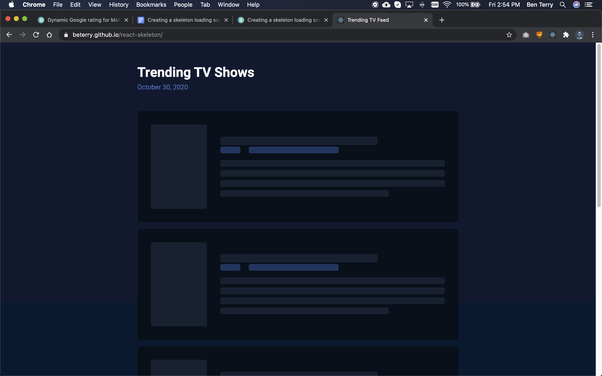
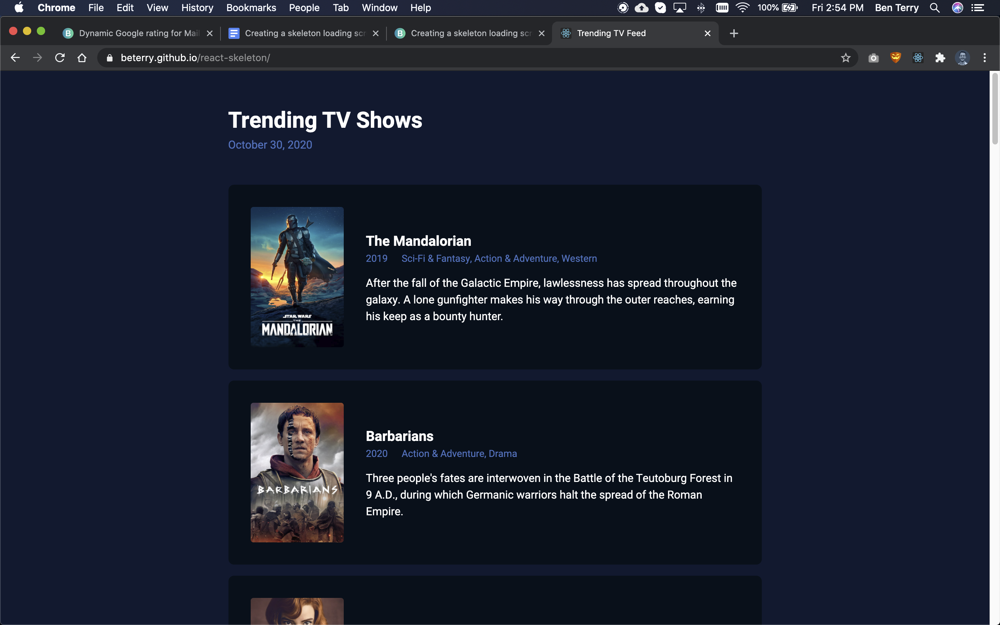

## About this project

In my last few blog posts, I’ve been experimenting with reading data from APIs. Last week, I read review information from Google to create a <LinkIn to="/blog/ms-google-rating/">dynamic star rating indicator</LinkIn> and two weeks before that, I created a simple <LinkIn to="/blog/movie-api/">movie search application</LinkIn> using The Movie Database API. Both of these projects had a similar flaw: while waiting for the API to respond, the interface displayed no information and then jarringly popped the information onto the screen when it was loaded. To me, this was a bad user experience and I wanted to further experiment with a way to fix this problem in the future.

Traditionally, to prevent users from seeing blank information while data is being fetched, developers would implement a loading spinner. However, this method does not solve the problem of information suddenly and unexpectedly popping to the screen. After some research, I discovered a modern, popular solution: a skeleton screen. 

Skeleton screens are visual placeholders indicating a loading state. They resemble low fidelity components. When data is properly loaded, the skeleton screen disappears, revealing the actual interface. Skeleton screens create a gradual loading effect which is a better, more seamless user experience than a traditional loading spinner.

Skeleton screens are used in a variety of popular web apps. I see one everyday when I visit Youtube.


<p class="caption">While Youtube fetches data, it displays a skeleton loading screen</p>

### Goals

1. Design an app which reads data from an API
2. While the data is being fetched, display a skeleton screen
3. When the data is loaded, display the actual interface

## Designing the interface

For this project, I wanted to display a list of items loaded from an API call. I’m always looking for a new tv show to watch, so I decided that creating a Trending TV feed could be fun. The Movie Database API, which I worked with previously and already had an API key for, has a route which returns a list of popular tv shows. How convenient!

In Adobe XD, I quickly designed a UI card for each tv show’s details and the corresponding skeleton card.


<p class="caption">I used Adobe XD to design both UI cards</p>

## Developing the cards

Before fetching any data from the API and playing around with loading skeleton screens, I first developed the static components.

### Create-react-app

I choose to develop this interface with React because it provides an easy way to conditionally inject components to the DOM. More on that later.

I used `create-react-app` to bootstrap the project.

```bash
npx create-react-app react-skeleton
```

### TV card

I created a new component named `Card.js` in my `src/components` directory. This component would eventually receive `props` from `App.js`, but originally contained static information based on my design mockup.

```jsx
// static card
export default function Card({poster}) {
    return (
        <article className="card">
            
            <div>
                <h2>Fear the Walking Dead</h2>
                <div className="meta">
                    <p>2015</p>
                    <p>Action & Adventure, Drama</p>
                </div>
                <p>What did the world look like as it was transforming into the horrifying apocalypse depicted in “The Walking Dead”? This spin-off set in Los Angeles, following new characters as they face the beginning of the end of the world, will answer that question.</p>
            </div>
        </article>
    )
}
```
### Skeleton card

After I developed the card component, I created another component named `Skeleton.js`. This component contained styled `div`s resembling a low-fidelity thumbnail image, title, and text. 

```jsx
//skeleton card
export default function Skeleton() {
    return (
        <div className="card">
            <div className="skel-line skel-img"/>
            <div>
                <div className="skel-line skel-title" />
                <div className="meta">
                    <div className="skel-meta skel-data"/>
                    <div className="skel-meta skel-cat"/>
                </div>
                <div className="skel-line skel-p" />
                <div className="skel-line skel-p" />
                <div className="skel-line skel-p" />
                <div className="skel-line skel-p skel-last" />
            </div>
        </div>
    )
}
```

In `App.js`, I rendered both components next to each other to make sure they looked similar.


<p class="caption">I tried to style the skeleton card to closly resemble the UI card</p>

## Fetching Data

After the static components were properly styled, I was ready to fetch data from the API.

### Lifecycle method

When fetching data from an external source in a React application, it’s important to use lifecycle methods to prevent data leakage and duplicate calls to the API. I placed my `fetch()` request in `App,js`’s `componentDidMount()` method. In this circumstance, this method is run one time on load.

Because `fetch()` and `json()` methods return a promise, I used `async await` syntax to handle this asynchronous behavior.

```js
//executes once after page load
async componentDidMount() {
    const showResponse = await fetch('https://api.themoviedb.org/3/trending/tv/week?api_key=32e2293c913c5d9fb');
    const shows = await showResponse.json();
    console.log(shows.results)
}
```

### Hold on, timeout

For most high-speed internet connections, this code would receive an API response and render the information in less than half a second. In that short bit of time, you would barely be able to see the skeleton screen. To solve this, I wanted to simulate a slow internet situation where the user would have to wait 3-5 seconds to see any information. In this situation, where nothing would be displayed on the screen for several seconds, skeleton screens are most useful.

In `componentDidMount()`, I wrapped my API calls in a `setTimeout()` method. This method delayed the API call for 5 seconds. So, after the page loads, `App.js` waited 5 seconds before requesting data from the API.

```js
//executes once after page load
componentDidMount() {
    //manual 5 sec delay to see skeleton components
    setTimeout(async () => {
        const showResponse = await fetch('https://api.themoviedb.org/3/trending/tv/week?api_key=32e2293c913c59ef64290d9fb');
        const shows = await showResponse.json();
        console.log(shows.results)
    }, 5000)
}
```

## Render skeleton or cards

It was then time to update the `render()` method of `App.js` to display a `Card.js` component for each tv show received from the API (or several skeleton cards, depending on the state of the application).

### Application State

I gave `App.js` a state which contained an array of show information. By default, on page load, the state is `null`. 

```js
class App extends React.Component {
    constructor(props) {
        super(props);
        this.state = {shows: null};
    }
    ...
```

In `componentDidMount()`, I updated the state of `App.js` to contain the information I received from the API call. Then, instead of being `null`, every object in `this.state.shows` correlated to a tv show which needed to be rendered in the list.

```js
componentDidMount() {
    setTimeout(async () => {
        const showResponse = await fetch('https://api.themoviedb.org/3/trending/tv/week?api_key=32e2293c913c59efc90d9fb');
        const shows = await showResponse.json();
        //update state with show data
        this.setState({shows: shows.results});
    }, 5000)
}
```

### Conditionally rendering the components

In `App.js`’s `render()` method, where before there was a static card and template component, I added two conditional statements. Only one would be true at a time.

The first statement renders a `Card.js` component for each tv show in `this.state.shows` when the state is not `null` (after the API call).

```js
//renders a card for each show in this.state.shows
this.state.shows && this.state.shows.map((show, index) => 
    <Card
        key={show.id}
        title={show.name}
        poster={`https://image.tmdb.org/t/p/w500/${show.poster_path}`}
        overview={show.overview}
        year={new Date(show.first_air_date).getFullYear()}
        genres={this.getGenreString(show.genre_ids)}
    />
)
```

The second statement renders 5 skeleton components to the DOM when `this.state.shows` equals `null` (for 5 seconds before the API call is made).

```js
//render 5 skeleton cards
!this.state.shows && [1, 2, 3, 4, 5].map(num => <Skeleton key={num}/>)
```

### Putting it all together

When the page loads, `this.state.shows` equals `null`. This results in 5 skeleton components being rendered to the screen acting as placeholders for the information. After 5 seconds, `App.js` makes a call to the API to receive a list of popular tv shows and sets `this.state.shows` to equal that list. The change of state triggers a re-render and, now that `this.state.shows` does not equal `null`, tv shows appear instead of skeletons.

Viola!

```js
class App extends React.Component {
    constructor(props) {
        super(props);
        this.state = {shows: null};
    }

    //executes once after page load
    componentDidMount() {
        //get shows and update state
        setTimeout(async () => {
            const showResponse = await fetch('https://api.themoviedb.org/3/trending/tv/week?api_key=32e2293c914290d9fb');
            const shows = await showResponse.json();
            this.setState({shows: shows.results});
        }, 5000)
    }

    return (
        <> 
            <header>
                <h1>Trending TV Shows</h1>
            </header>
            <main>
                {this.state.shows && this.state.shows.map((show, index) => 
                    <Card
                        key={show.id}
                        title={show.name}
                        poster={`https://image.tmdb.org/t/p/w500/${show.poster_path}`}
                        overview={show.overview}
                        year={new Date(show.first_air_date).getFullYear()}
                        genres={this.show.genre_ids}
                    />
                )}
                {!this.state.shows && [1, 2, 3, 4, 5].map(num => <Skeleton key={num}/>)}
            </main>
        </>
    );
}
```


<p class="caption">For 5 seconds, skeleton cards render</p>


<p class="caption">After 5 seconds, data loads and tv shows are rendered</p>

## Animating the skeleton cards

As a finishing touch, I created a component named `Shimmer.js` and added it to `Skeleton.js`. This component simply adds an animation to the skeleton to improve the user experience.

```jsx
export default function Shimmer() {
    return (
        <div className="shimmer-container">
            <div className="shimmer" />
        </div>
    )
}
```

```css
.shimmer-container{
    position: absolute;
    top: 0;
    left: 0;
    width: 100%;
    height: 100%;
    animation: loading 2.5s infinite;
}

.shimmer{
    width: 50%;
    height: 100%;
    background: rgba(0,40,116,.1);
    transform: skew(-20deg);
}

@keyframes loading{
    0%{transform: translate(-100%);}
    100%{transform: translate(150%);}
} 
```

## Final thoughts

It’s just now dawning on me, as I write these final thoughts, it’s Halloween this week. How appropriate to write about SKELETONS. I swear I didn’t plan that.

Please check out the demo or full code Github repo:

<LinkOutButton url="https://beterry.github.io/react-skeleton/">View Demo</LinkOutButton>
<LinkOutButton url="https://github.com/beterry/react-skeleton">Github code</LinkOutButton>

I’m very happy with the final demo of this experiment. Skeleton screens are easy to implement in React applications and create a more seamless experience than a typical loading spinner. For projects in the future, which read data from an API, expect to see a skeleton loading screen from me!
