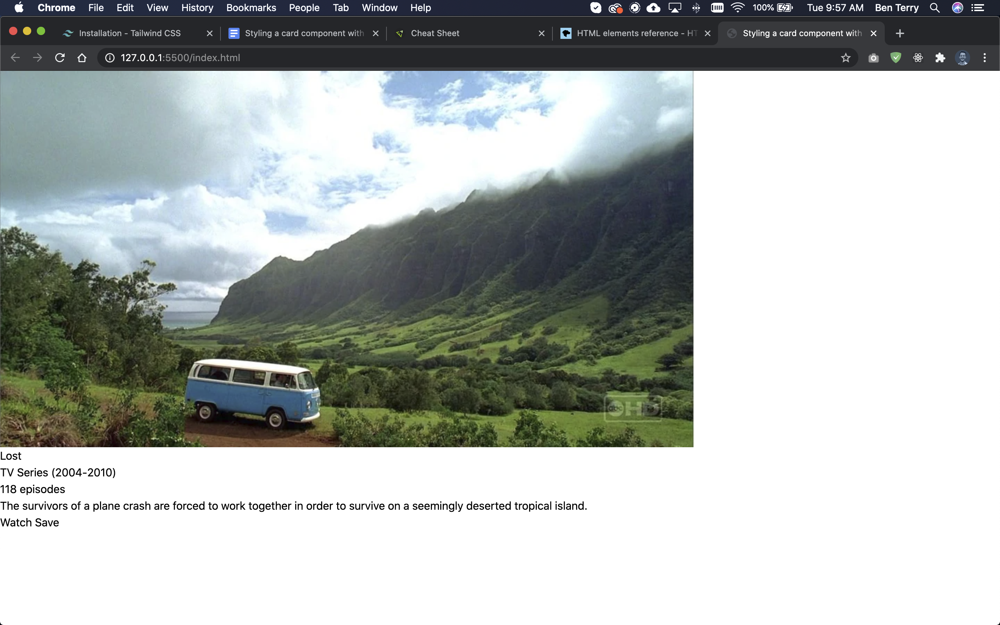

## About this experiment

After several years of learning CSS basics and becoming comfortable with the language, I think it’s now beneficial to experiment with popular CSS libraries/frameworks to understand why they are popular and if they would be a good fit in my development workflow.

## What’s Tailwind CSS

Tailwind CSS is an increasingly popular CSS framework. Unlike other CSS frameworks (like Bootstrap), Tailwind aims to be completely unopinionated; meaning it provides a blank slate for the developer to customize, not pre-built components and layouts that are difficult to override. The framework provides extensive utility classes which a developer can use to style an interface without writing a single line of CSS.

### Goals
1. Write no CSS
2. Experiment with building a component with Tailwind utility classes

## Designing the component

I started this experiment by designing the component I wanted to build in Adobe XD, my preferred design software. I created the design based on what features in Tailwind I wanted to experiment with:

- Flexbox
- Responsiveness
- Hover states
- Transitions


<p class="caption">I first designed the card component in Adobe XD.</p>

## Getting Started

There are several ways to install and configure Tailwind in a project. In the documentation, they recommend simply linking the CDN build for quick demos such as this experiment.

It’s worth noting, and I’ll do another experiment in the future about this, many features that make Tailwind powerful and popular are not available through the CDN and require a build process. These include:

- You can't customize Tailwind's default theme
- You can't use any directives like @apply, @variants, etc.
- You can't enable features like group-hover
- You can't install third-party plugins
- You can't tree-shake unused styles

But for this experiment I aimed to use utility classes to style a simple component so the convenient CDN worked perfectly.

`<link href="https://unpkg.com/tailwindcss@^1.0/dist/tailwind.min.css" rel="stylesheet">`

## HTML Structure

To start, I built out my HTML structure with no utility classes.

The first thing I noticed when viewing the unstyled HTML in the browser was how unopinionated Tailwind is. The heading has no weight and is the same size as the paragraph text. There are no margins or padding on the `<body>` element. Linking Tailwind CSS acted as a CSS reset.

```HTML
<!DOCTYPE html>
<html lang="en">
<head>
    <meta charset="UTF-8">
    <meta name="viewport" content="width=device-width, initial-scale=1.0">
    <title>Styling a card component with Tailwind CSS</title>
    <link href="https://unpkg.com/tailwindcss@^1.0/dist/tailwind.min.css" rel="stylesheet">
</head>
<body>
    <!-- card -->
    <div>
        <!-- top half -->
        <div
            style="background-image: url(https://vignette.wikia.nocookie.net/lostpedia/images/a/a9/Curtain-cap587.jpg/revision/latest/scale-to-width-down/1000?cb=20070521233714);"
        ></div>
        <!-- bottom half -->
        <div>
            <!-- content -->
            <div>
                <h3>Lost</h3>
                <div>
                    <p>TV Series (2004-2010)</p>
                    <p>118 episodes</p>
                </div>
                <p>The survivors of a plane crash are forced to work together in order to survive on a seemingly deserted tropical island.</p>
            </div>
            <!-- button container -->
            <div>
                <a href="#">Watch</a>
                <a href="#">Save</a>
            </div>
        </div>
    </div>
</body>
</html>
```


<p class="caption">The unstyled HTML structure displayed in the browser.</p>

## Styling with utility classes

After the HTML was written, I started adding Tailwind utility classes to the elements.

I used the Tailwind documentation to discover what classes existed in the framework and how to use them to achieve the styles that I desired. The documentation is really great. I was easily able to find great instruction very quickly.

Checkout the code below! You can see how I was able to add bite-sized utility classes to the elements to create my card component.

```HTML
<!DOCTYPE html>
<html lang="en">
<head>
    <meta charset="UTF-8">
    <meta name="viewport" content="width=device-width, initial-scale=1.0">
    <title>Styling a card component with Tailwind CSS</title>
    <link href="https://unpkg.com/tailwindcss@^1.0/dist/tailwind.min.css" rel="stylesheet">
</head>
<body class="min-h-screen bg-gray-200 flex justify-center items-center relative">
    <!-- card -->
    <div class="flex flex-col md:flex-row md:max-w-xl bg-white max-w-xs rounded-lg overflow-hidden shadow-xl">
        <!-- top half -->
        <div
            style="background-image: url(https://vignette.wikia.nocookie.net/lostpedia/images/a/a9/Curtain-cap587.jpg/revision/latest/scale-to-width-down/1000?cb=20070521233714);"
            class="bg-cover w-full md:w-1/2 h-64 md:h-auto"
        ></div>
        <!-- bottom half -->
        <div class="p-2 md:w-1/2">
            <!-- content -->
            <div class="p-2">
                <h3 class="text-2xl font-bold">Lost</h3>
                <div class="flex text-xs text-gray-600">
                    <p class="pr-2 border-r">TV Series (2004-2010)</p>
                    <p class="pl-2">118 episodes</p>
                </div>
                <p class="my-4">The survivors of a plane crash are forced to work together in order to survive on a seemingly deserted tropical island.</p>
            </div>
            <!-- button container -->
            <div class="flex">
                <a href="#" class="uppercase text-indigo-600 tracking-wider py-2 px-4 hover:bg-indigo-100 rounded transition duration-300">Watch</a>
                <a href="#" class="uppercase text-indigo-600 tracking-wider py-2 px-4 hover:bg-indigo-100 rounded transition duration-300">Save</a>
            </div>
        </div>
    </div>
    <p class="absolute bottom-0 py-4 text-gray-500 text-s">Adjust screen width to see responsiveness</p>
</body>
</html>
```

[](https://beterry.github.io/tailwind-card/)
<p class="caption">This card was styled with Tailwind utility classes</p>

<LinkOutButton url="https://beterry.github.io/tailwind-card/">Check it out!</LinkOutButton>

## Final thoughts

### Great documentation

Tailwind’s documentation is simply stellar; Great organization and direction throughout. I styled this component from scratch, knowing nothing about Tailwind beforehand, in less than an hour because they explain the framework so wonderfully.

### Easy and unopinionated

I really liked the unopinionated nature of the Tailwind CSS framework. I’m a developer who enjoys styling elements from a blank slate. I usually begin projects by importing a CSS reset. Using Tailwind saved me that step.

The Tailwind naming convention was simple to understand and, with some more experience, memorize. 

### Best to use components

For this simple experiment, it wasn’t much hassle to copy and paste the utility classes from one identical component to the next (the button links). However, for a larger project, I believe writing every utility class inline would become hard to maintain. 

For myself, I believe Tailwind CSS could be efficient for styling reusable components with React. I currently use styled-components to style my projects, however, it’s often time consuming to create all the variables to style many elements. With Tailwind CSS, I could quickly write the utility classes inline and use the component repeatedly throughout the project.
