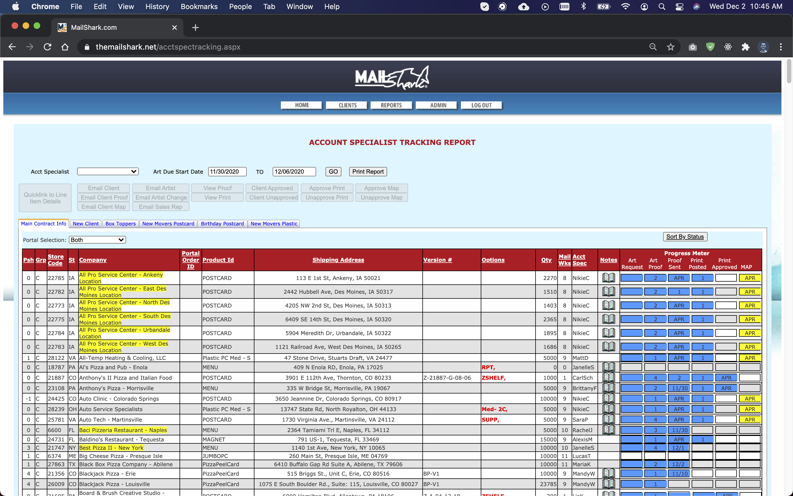
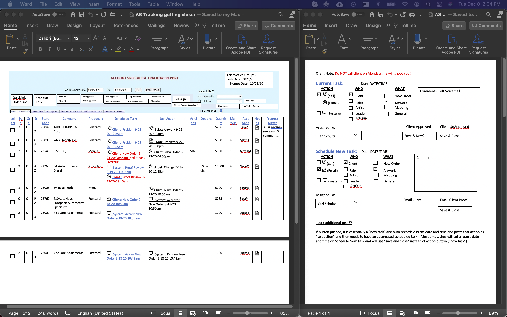
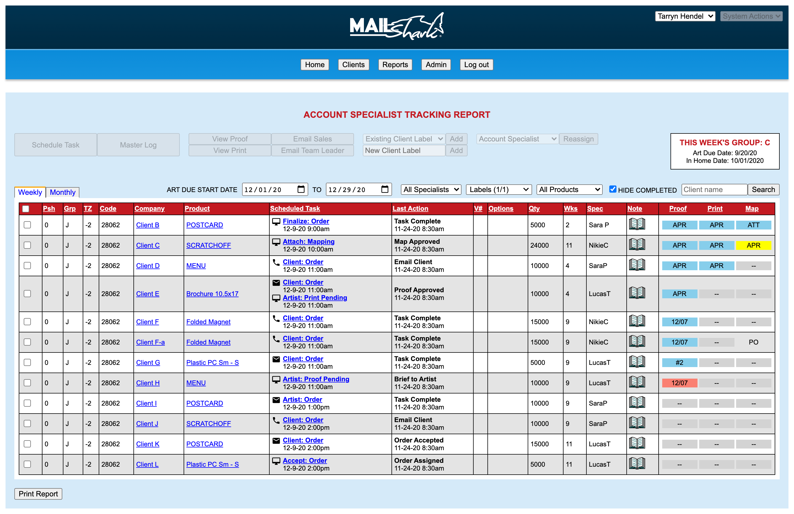
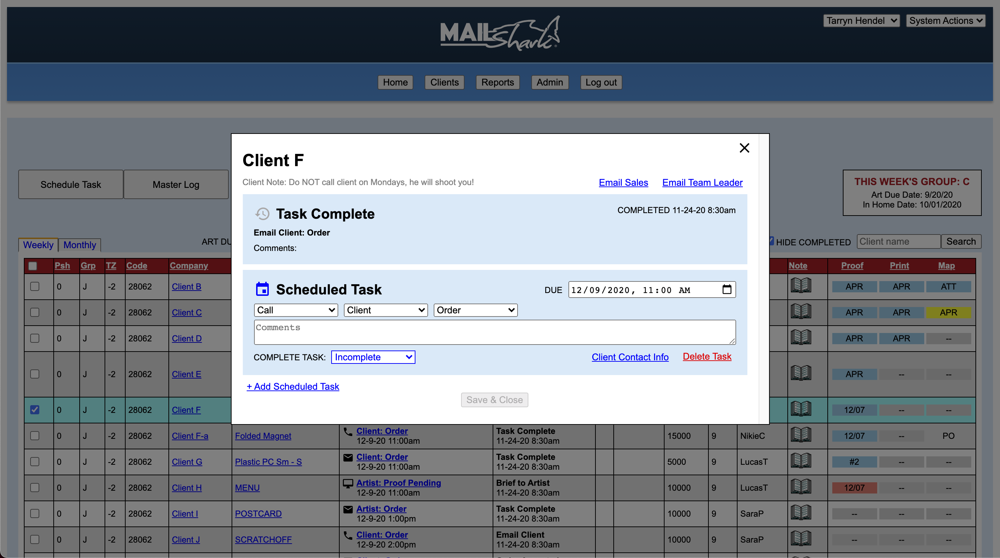

import { graphql } from "gatsby"

## About this project

The Account Specialist team at Mail Shark is responsible for communicating with clients about upcoming mailing campaigns. They ensure the artwork and mapping is approved by the client and ready for the mailing start date. At Mail Shark, the Account Specialists use an internal tool called the “Tracking Report” to view the progress of their assigned campaigns and determine which steps need to be taken towards completion.

To increase Account Specialist productivity, Team Leaders wanted to improve this tool by adding task management features. I worked with several Team Leaders to plan, prototype, and test the new user experience.

Due to the complexity of this project, I suggested working in multiple sprints. We decided to break the project into two sprints. The first sprint (really more of a jog) was scheduled to take 4 weeks and focus on usability and experience, using the same styling as the existing tool. The second sprint would entail a design overall once the functionality is tested and approved.

## Stakeholder meeting

Before the stakeholder meeting, the Tracking Report was unknown to me. In this meeting, the stakeholders explained the tool, how it was used, and presented me with features they believed would improve an Account Specialist’s daily productivity. 

### The previous tool

The Tracking Report is a data table. Every row in the table is an active job that the Account Specialist is assigned. To move a job through its lifecycle and update the progress meter, the Account Specialist selects a job row and interacts with action buttons at the top of the interface.

After the stakeholder meeting, I understood the previous interface lacked any indication of an Account Specialist’s next task. An Account Specialist inefficiently relied on memory or interpreted the progress meter to know the next task needed to be completed. 


<p class="caption">The existing tool lacked several features, limiting Account Specialist productivity</p>

### The ask

The stakeholders believed that three new task management features could help improve productivity:

#### Task columns

The Team Leaders wanted to add explicit direction about the previous and next tasks for each job in the table. The goal was to allow an Account Specialist to quickly look through their assigned jobs and understand instantly what happened the last time they talked to the client and their next task.

#### Scheduler modal

To manage and complete tasks, the Team Leaders envisioned a pop-up modal to replace the existing suite of buttons at the top of the interface. To schedule a new task, an Account Specialist would open the modal and describe the new task by selecting an “Action”, “Who”, and “What”. To complete a task and update the progress meter, the modal would contain contextual action buttons.

#### Master log
The master log would record each task performed throughout a job’s life cycle. It would record the task, when it was completed, who completed it and any notes about the task.


<p class="caption">The Team Leaders provided several documents to help me better understand the functionality of the new features.</p>

### Agile workflow

This project was very consequential because it was the first project at Mail Shark I was allowed to complete in multiple sprints. Although I pitched working in multiple, 1 week sprints, we decided in the stakeholder meeting to compromise. The project would be completed at the end of 2, month-long sprints. 

The first sprint would focus on functionality and adding the new features without editing the existing design aesthetic. Once the functionality was tested and approved, the second sprint would involve a  redesign to a more modern interface.

## Sprint 1

### Goals

1. Focus on functionality over aesthetic
2. Improve the experience of the Account Specialist Tracking Report by implementing new features which would allow users to more effortlessly manage tasks
3. Develop a fully functional prototype
4. Test the new experience by allowing Account Specialists to use the new tool and provide feedback

### Wireframing the interface

After the stakeholder meeting, I sketched wireframes to layout all the features in the sprint backlog.

<Screens
    images={[
        props.data.wire.edges[0].node.childImageSharp.fluid,
        props.data.wire.edges[1].node.childImageSharp.fluid,
        props.data.wire.edges[2].node.childImageSharp.fluid,
    ]}
    before
/>
<p class='caption'>The wireframes I created for each of the three new features</p>

### Developing the prototype

Because Sprint 1 did not involve redesigning the current styles of the previous tool, I was able to skip “skinning” the wireframes in Adobe XD and start coding the prototype. This is a great example of how working in an Agile environment saved time.

At Mail Shark, I not only plan and design user experiences but I also develop the experience using modern web technology. This process allows me to produce a prototype that behaves more like a finished product, allowing for more intuitive testing. I develop the prototype, user test, and collect feedback all before sending the design to our outsourced developer for production.


<p class="caption">The new task management columns in the finished prototype.</p>


<p class="caption">The Scheduler modal in the finished prototype.</p>

#### Tech stack

- React
- React Router
- Sass

#### Coding Challenges

During prototype development, I encountered a few challenges which required extra research and effort to solve. I enjoy being presented a challenge. These opportunities allow me to flex my problem solving muscles and further master web technology.

##### Updating mutable objects in state arrays

I encountered a glitch while coding the Scheduler modal. When I edited a task in the modal and exited without saving, the changes were being saved regardless.

After some frustration and several hours of research, I discovered that I was incorrectly setting the state of the Scheduler.

When the Scheduler was opened, I was setting the Scheduler's state directly from `props.job`.

```js
export default class Scheduler extends Component {
    constructor(props){
        super(props);
        this.state = ({
            tasks: props.job, // this was incorrect
        });
    }
    //rest of the component
}
```

`props.job` was directly referencing the mutable state in my application. In the background, as I was updating the state of the Scheduler, I was unknowingly updating the application’s state as well.

To solve this problem, I used array and object destructuring to set the Scheduler’s state in `componentDidMount()`. By setting state this way, the new Scheduler state no longer referenced the application's state and when the modal was closed without saving, the edits did not persist.

```js
componentDidMount(){
    let tasks = [];
    const tasksFromProps = [...this.props.job.scheduledTasks];

    // loop through destructured tasks and add them to a new array
    tasksFromProps.forEach(task => {
        const spreadTask = {...task};
        tasks.push(spreadTask);
    })

    // set state array which does not reference the main application's state
    this.setState({tasks});
}
``` 

##### Creating a multi-select dropdown to filter client labels

The Team Leaders asked for a labeling system in which they could assign a label to a job and then filter which jobs to view by selecting or deselecting multiple labels from a dropdown. 

By default, HTML5 does not have a great solution for multi-select dropdowns. I decided to develop a custom component to handle this specific functionality. 

The application holds a state which tracks which labels to show in the table.

```js
class App extends Component {
    constructor(props) {
        super(props);
        this.state = {
            filterClientLabel: ["Default"],
           // more state
        };
    }
    // the rest of the appliction
}
```

The custom dropdown component reads in 3 `props`: the labels being displayed, the options based on all jobs, and a `changeClientLabel` function.

```jsx
<ClientLabelFilter
    labels={this.state.filterClientLabel}
    options={[...clientLabelOptions]}
    changeClientLabel={this.changeFilterClientLabel}
/>
```

The component has one state: `showOptions`. This value gets toggled by clicking the button which resembles a `<select>` element. The dropdown uses a `ref` to close the options when the user clicks outside the component.

```jsx
class ClientLabelFilter extends Component {
    constructor(props){
        super(props);
        this.state = {
            showOptions: false,
        }
    }

    handleCheckOption(e, option){
        this.props.changeClientLabel(option);
    }

    toggleShowOptions(e){
        e.preventDefault();
        this.setState({
            showOptions: !this.state.showOptions
        })
    }

    render(){
        return (
            <div>

                {/* button resembles a <select> element */}
                <button onClick={(e) => this.toggleShowOptions(e)}>
                    {`Labels (${this.props.labels.length}/${this.props.options.length + 1})`}
                    
                </button>

                {/* Show dropdown when state is true */}
                {this.state.showOptions && 
                    <DropDown close={(e) => this.toggleShowOptions(e)}>

                        {/* The default option is always available */}
                        <div>
                            <input
                                type="checkbox"
                                name={`labelOp-default`}
                                onChange={(e) => this.handleCheckOption(e, "Default")}
                                checked={this.props.labels.includes("Default")}
                            />
                            <label htmlFor={`labelOp-default`}>Default</label>
                        </div>

                        {/* Loop through options add render them into the dropdown */}
                        {this.props.options.map((option, index) => 
                            <div key={`labelOp-${index}`}>
                                <input
                                    name={`labelOp-${index}`}
                                    type="checkbox"
                                    onChange={(e) => this.handleCheckOption(e, option)}
                                    checked={this.props.labels.includes(option)}
                                />
                                <label htmlFor={`labelOp-${index}`}>{option}</label>
                            </div>
                        )}

                    </DropDown>
                }

            </div>
        )
    }
}

class DropDown extends Component{
    constructor(props) {
        super(props);
        this.myRef = React.createRef();
      }

    componentDidMount() {
        document.addEventListener('click', this.handleClickOutside, true);
    }
    
    componentWillUnmount() {
        document.removeEventListener('click', this.handleClickOutside, true);
    }
    
    handleClickOutside = (e) => {
        if (this.myRef && !this.myRef.current.contains(e.target)) {
            this.props.close(e);
        }
    }

    render(){
        return(
            <div
                className="filter-labels_drop"
                ref={this.myRef}
            >
            {this.props.children}
            </div>
        )
    }
}
```

### Testing the prototype

The prototype I developed allowed me to more accurately user test because the interface behaved more like a final product. We discovered and implemented many improvements after allowing Account Specialists to test the new features.


<p class="caption">The Scheduler modal before testing. Many improvments were made to the component after user testing.</p>

#### Company name in Scheduler

This was a simple fix. Sometimes the most obvious features are overlooked in the design process. That is why testing is so important!

After opening the Scheduler, Account Specialists would comment that they forgot which job they opened. The solution was to add the company name to the top of the modal.

#### Icons in Scheduler

Multiple users commented, “I can’t tell that selecting an action from the dropdown is completing the task.”

During testing, the modal used a color code to signify task completion. An incomplete task’s “Action Dropdown” would be red; a completed “Action Dropdown” would be green. This was too subtle of a change and felt underwhelming.

To solve this problem, and make the change in completion more significant, I added icons next to the title of the task. When the task’s completion status was changed, the icon would change to a checkbox and the title would change to the action text. This was a more meaningful UI change to signify a meaningful action.

#### Auto-scheduling tasks

Our goal was to create an intuitive workflow for the the Account Specialits. However, this took several rounds of testing to achieve. 

To reach our goal, the Team Leaders provided me with a list of actions and the tasks that would follow. Based on this information, I wrote logic into the Scheduler which automatically scheduled appropriate tasks after a task is completed. This feature greatly improved the efficiency of the tool by making scheduling tasks effortless and reducing the amount of clicks necessary to schedule a task.


<p class="caption">Scheduler modal after testing. Title, icons, and auto scheduling were added for an enhanced user experience.</p>

### Completing the sprint

This sprint was a monumental success. 

Developing the prototype in sprints allowed the team and I to focus on functionality. This Agile methodology saved time by preventing us from having to simultaneously revise styling. We easily meet our desired deadline.

During testing, the Account Specialists who provided feedback were already familiar with the tool’s styling. This familiarity allowed them to purely focus on usability which resulted in great recommendations for improvement.

The Team Leaders were thrilled with the results and the feedback from the Account Specialists and looked forward to re-styling the tool in the next sprint.


export const pageQuery = graphql`
    query trackerQuery{
        mainImage: allFile(filter: {relativeDirectory: {eq: "as-tracker/images/main"}}) {
            edges {
                node {
                    childImageSharp {
                        fluid {
                            ...GatsbyImageSharpFluid
                        }
                    }
                }
            }
        }
        wire: allFile(filter: {relativeDirectory: {eq: "as-tracker/images/wire-1"}}, sort: {order: ASC, fields: name}) {
            edges {
                node {
                    childImageSharp {
                        fluid {
                            ...GatsbyImageSharpFluid
                        }
                    }
                }
            }
        }
    }
    
`