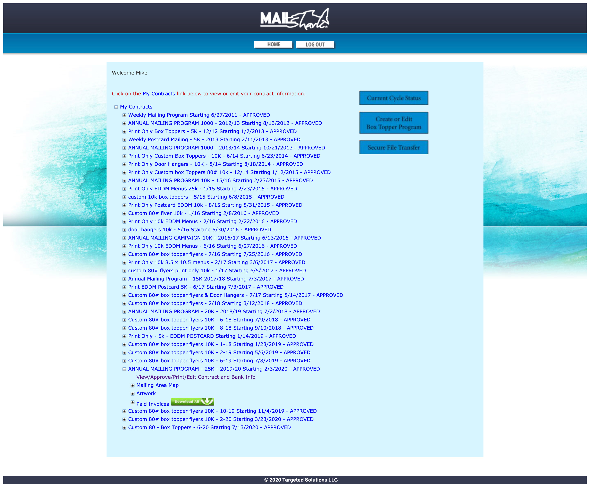

import { graphql } from "gatsby"

## About Mail Shark’s customer portal

Mail Shark is an industry-leading direct mail and print company located in Mohnton, Pennsylvania. They offer many different services including unique, pay-weekly mailing programs and commercial printing. After enrolling in a program at Mail Shark, a customer gets access to an online portal where they can view contract details, upload files, and much more.

In 2020, redesigning the customer portal was a priority for Mail Shark's marketing department. As UI/UX Designer, I was responsible for the planning, designing, and developing the prototype for the improved customer experience. 

## Planning

### Stakeholder Meeting

The purpose of the stakeholder meeting, which involved the President of Mail Shark, the VP of Business Operations, the VP of Marketing, the Creative Manager and myself, was to strategize about project priorities and goals.

#### Minimum viable product

The ability for a customer to view their contracts online is the largest and most important feature of the portal. It was decided that this feature would be the minimum viable product for the new design. The plan was to redesign, develop, and launch the new contract viewing experience initially and add new redesigned features at a later date.

#### Goals

1. Provide an easy way for customers to view campaign and contract information
2. Allow a customer with multiple locations/stores to see all their campaigns in one place
3. Create a modular design pattern that is easy to expand in the future with more information and features

### Problems with the existing interface


<p class='caption'>A screenshot of the existing customer portal interface.</p>

#### Not mobile friendly

The existing design did not scale to mobile. We wanted our customer’s to have the ability to view their contract information on the go and on any screen.

#### Poor organization

The contract viewing experience, previously, was very poorly organized. 

1. When the user unfolded the contract list, it was displayed showing the oldest contracts first. For many customers, who have been with Mail Shark for 5+ years, this meant scrolling through several dozen completed contracts to view the most recent entries. 
2. Completed contracts were shown by default. While there are situations where a customer would want to view a completed contract’s details, the vast majority of customers only care to view contracts that are ongoing or pending approval.
3. The displayed contract name included the mailing quantity, start date, and status. Bunching all of this information into the title of the contract was confusing for the user.

#### Branding

The old portal’s design was outdated (it was created in 2010) and included no current branding from the website. The online portal and Mail Shark’s website looked completely disconnected.

### Wireframing

During the wireframing process, I brainstormed low fidelity features, layouts and components which would solve the existing interface’s problems and accomplish the goals we discussed in the stakeholder meeting.

<Screens
    images={[
        props.data.wire.edges[0].node.childImageSharp.fluid,
        props.data.wire.edges[1].node.childImageSharp.fluid,
    ]}
/>
<p class='caption'>Wireframe of the contract list</p>

<Screens
    images={[
        props.data.wire.edges[2].node.childImageSharp.fluid,
        props.data.wire.edges[3].node.childImageSharp.fluid,
    ]}
/>
<p class='caption'>Wireframe of the contract details</p>

#### Designing for mobile screens

While wireframing, I made sure to design for mobile screens first. I wanted to ensure all the contract information was readily available and easy to access.

I planned to display the contracts as a list on small screens and expand the information to a table on larger screens.

#### Improving the contract list

The wireframes above show several new features which make the contract list easier to read and navigate:

1. By default, the list is sorted with most recent contracts at the top.
2. By default, completed contracts are hidden. This allows the users to more easily view the contracts that are currently ongoing or pending approval. A *show completed* button would be under the initially shown contracts.
3. On mobile screens, users sort the list with a dropdown selection at the top. When viewing the table, the user sorts by clicking the column heading.
4. Contract details (quantity, starting date, business) are separated into rows and columns.

#### Planning for future features
To allow for future feature additions, I wireframed a layout which uses a navigation drawer and app bar. The easily expandable navigation drawer would remain static throughout the customer portal, linking the features together. The app bar contains contextual buttons which can be changed to accommodate any new features and controls.

## Designing the new interface

My preferred prototyping software is Adobe XD. I used this software to design the prototype.

<Screens
    images={[
        props.data.proto.edges[0].node.childImageSharp.fluid,
        props.data.proto.edges[1].node.childImageSharp.fluid,
    ]}
/>
<p class='caption'>The finished design of the contract list.</p>

<Screens
    images={[
        props.data.proto.edges[2].node.childImageSharp.fluid,
        props.data.proto.edges[3].node.childImageSharp.fluid,
    ]}
/>
<p class='caption'>A new contract details interface.</p>

### Material Design

Google’s Material Design is a wonderful design system for creating great user interfaces. To build the portal’s interface, I used Material Design’s extensive guides to research component best practices, behavior, and specs.

### Before and after

<Screens
    images={[
        props.data.before.edges[0].node.childImageSharp.fluid,
        props.data.proto.edges[1].node.childImageSharp.fluid,
    ]}
    before
/>
<p class='caption'>The out-dated, existing interface (left) was redesigned into a modern dashboard experience (right).</p>

## Developing the prototype

Although XD has powerful prototyping features, I developed a functional prototype to more adequately show the effectiveness of the new interface.

<LinkOutButton url="https://beterry.github.io/contract-ux/">View the Prototype</LinkOutButton>

### Technology used

- React
- React-router
- Sass
- Moment.js
- Numeral.js

### Interesting code snippets

<LinkOutButton url="https://github.com/beterry/contract-ux">View Github Repo</LinkOutButton>

#### Static data

The prototype did not consume an API. It relied on local JSON data for information to display.

```js
// STATUS CODES
// 0 - actions required
// 1 - active
// 2 - completed

export default {
    1001: {
        id: 1001,
        name: "Print Box Toppers",
        status: 0,
        business: "Scranton #120",
        quantity: 10000,
        starting: new Date(2020, 6, 13),
        ending: new Date(2020, 8, 15),
        campaigns: [
            {
                product: 'Box Toppers',
                start: new Date(2020, 6, 13),
            }
        ],
        invoices: []
    },
    ...
}
```

#### Sorting contracts

I used this utility function to sort the contract list depending on the application's state.

```js
//returns new, sorted array
export default function(sortBy, contracts) {
    let sortedContracts = contracts

    switch(sortBy){
        case 'dateAsc':
            sortedContracts.sort((a, b) => a.starting - b.starting)
            break
        case 'nameDesc':
            sortedContracts.sort((a, b) => {
                var nameA = a.name.toUpperCase(); // ignore upper and lowercase
                var nameB = b.name.toUpperCase(); // ignore upper and lowercase
                if (nameA < nameB) {
                    return -1;
                }
                if (nameA > nameB) {
                    return 1;
                }
                // names must be equal
                return 0;
            })
            break
        case 'nameAsc':
            sortedContracts.sort((a, b) => {
                var nameA = a.name.toUpperCase(); 
                var nameB = b.name.toUpperCase(); 
                if (nameA < nameB) {
                    return 1;
                }
                if (nameA > nameB) {
                    return -1;
                }
                return 0;
            })
            break
        case 'quantityDesc':
            sortedContracts.sort((a, b) => b.quantity - a.quantity)
            break
        case 'quantityAsc':
            sortedContracts.sort((a, b) => a.quantity - b.quantity)
            break
        case 'busDesc':
            sortedContracts.sort((a, b) => {
                var businessA = a.business.toUpperCase();
                var businessB = b.business.toUpperCase();
                if (businessA < businessB) {
                    return -1;
                }
                if (businessA > businessB) {
                    return 1;
                }
                return 0;
            })
            break
        case 'busAsc':
            sortedContracts.sort((a, b) => {
                var businessA = a.business.toUpperCase();
                var businessB = b.business.toUpperCase();
                if (businessA < businessB) {
                    return 1;
                }
                if (businessA > businessB) {
                    return -1;
                }
                return 0;
            })
            break
        //dateDesc
        default:
            sortedContracts.sort((a, b) => b.starting - a.starting)
            break
    }
    return sortedContracts
}
```

#### Application render function

```js
render(){
    let sortedContracts = this.state.allContracts
    
    //filter out completed
    if (!this.state.showCompleted) {
        sortedContracts = sortedContracts.filter((contract) => contract.status !== 2)
    }

    //function to sort array based on state
    //found in utility folder
    sortedContracts = sortContracts(this.state.sort, sortedContracts)

    //calculate # of completed contracts to pass to list
    let numberCompleted = 0
    this.state.allContracts.forEach((contract) => {
      if(contract.status === 2){
        numberCompleted++
      }
    })

    return (
      <Router>
        <Layout>
          <Switch>
            {/* render Details section*/}
            <Route path="/contracts/:contractId">
              <Details contracts={data}/>
            </Route>
            {/* render ContractList section*/}
            <Route path="/contracts">
              <ContractList
                sortedContracts={sortedContracts}
                changeSort={this.changeSort}
                toggleCompleted={this.toggleCompleted}
                sort={this.state.sort}
                showCompleted={this.state.showCompleted}
                numberCompleted={numberCompleted}
              />
            </Route>
            {/* render Message section for everything else*/}
            <Route exact path="*">
              <Message />
            </Route>
          </Switch>
        </Layout>
      </Router>
    )
  }
}

}
```

## Final Thoughts
Overall, I enjoyed the challenge of thinking through the contract viewing experience and reorganizing the data to improve the interface. In the future, I look forward to expanding this design with new features.

export const pageQuery = graphql`
    query contractQuery{
        mainImage: allFile(filter: {relativeDirectory: {eq: "contract-ux/images/main"}}) {
            edges {
                node {
                    childImageSharp {
                        fluid {
                            ...GatsbyImageSharpFluid
                        }
                    }
                }
            }
        }
        wire: allFile(filter: {relativeDirectory: {eq: "contract-ux/images/wire"}}, sort: {order: ASC, fields: name}) {
            edges {
                node {
                    childImageSharp {
                        fluid {
                            ...GatsbyImageSharpFluid
                        }
                    }
                }
            }
        }
        proto: allFile(filter: {relativeDirectory: {eq: "contract-ux/images/proto"}}, sort: {order: ASC, fields: name}) {
            edges {
                node {
                    childImageSharp {
                        fluid {
                            ...GatsbyImageSharpFluid
                        }
                    }
                }
            }
        }
        before: allFile(filter: {relativeDirectory: {eq: "contract-ux/images/before"}}) {
            edges {
                node {
                    childImageSharp {
                        fluid {
                            ...GatsbyImageSharpFluid
                        }
                    }
                }
            }
        }
    }
`