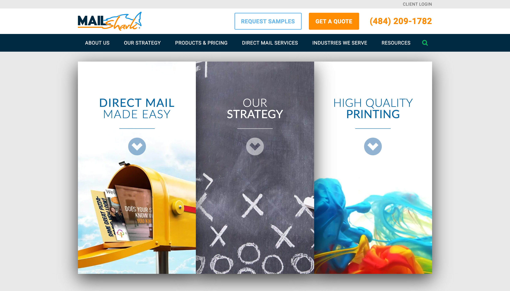
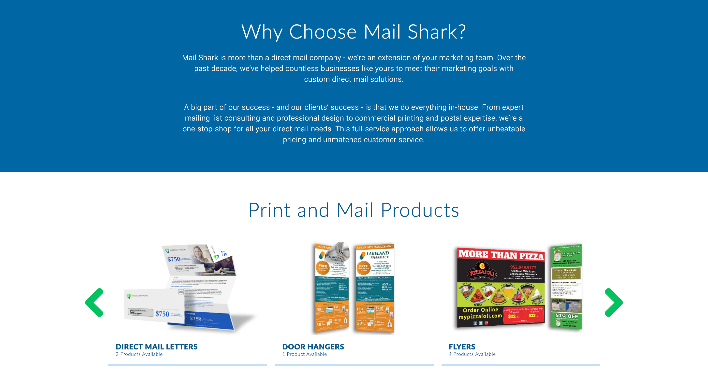

import { graphql } from "gatsby"

## Why redesign?

In early 2020, Mail Shark’s homepage design was 3 years old. In the 3 years since the existing homepage went live, the marketing department (which included myself) made great progress with evolving Mail Shark’s brand to be a more focused and cohesive experience. The homepage of Mail Shark’s website was falling behind the brand.

The existing homepage felt disconnected from the newer website pages: it was text heavy and used a disjointed combination of icon styles and photography. As UI/UX Designer at Mail Shark, I was responsible for planning, designing, and prototyping an updated homepage which would reflect Mail Shark’s brand in 2020.


<p class='caption'>The old design used a foldable component which, according to analytic data, was never used by viewers.</p>


<p class='caption'>Text-heavy content on the old design.</p>

## Planning

### Stakeholder meeting

I first meet with the President of Mail Shark, the Marketing VP, and the Creative Manager to discuss the goals, features, and tone of the new homepage. 

In short, the content on the existing page was adequate, however, it needed to be organized to include less text and include updated brand components.

### Goals

1. Provide a concise description of the company and easily provide a way to learn more
2. Show the user why Mail Shark is better than the competition
3. Tie the brand together with a uniform, user-friendly, mobile accessible design

### Wireframing

During the wireframing process, I re-organized the existing information and brainstormed which brand components could accomplish and solve all the goals we discussed in the stakeholder meeting.

<Screens
    images={[
        props.data.wire.edges[0].node.childImageSharp.fluid,
        props.data.wire.edges[1].node.childImageSharp.fluid,
    ]}
/>

#### Describing Mail Shark
There was not a clear `<h1>` on the previous homepage design. The old design used a foldable component which, according to analytic data, was never used by viewers.

On the new homepage, I planned to use a clear `<h1>` and intro text to clearly define Mail Shark.

#### Reorganizing the information

During wireframing, I condensed the existing paragraphs of information into a concise section about how Mail Shark is different from the competition. 

- Mail and Pay Weekly
- No Money Down
- Free Professional Design

To draw the viewer’s eye to each differentiator, I planned to design branded icons.

#### How it works

I wanted to display Mail Shark’s enrollment process in a creative way. I wireframed a section which reads like a text conversation between a sales representative and a customer. This layout accomplishes two things:

1. Shows how easy Mail Shark makes enrolling in a direct mail campaign
2. Displays the high-quality customer service one gets when working with Mail Shark

#### Mobile components

I designed for mobile screens first. To prevent the page from getting too long on small screens, I organized most information into cards which scroll horizontally. 

## Designing the prototype

Adobe XD is my preferred software for designing and prototyping interfaces. I used Adobe XD to apply Mail Shark’s most recent design components, typography and colors to the wireframe.

<Screens
    images={[
        props.data.proto.edges[0].node.childImageSharp.fluid,
        props.data.proto.edges[1].node.childImageSharp.fluid,
    ]}
/>

## Developing the prototype

After the design was completed, I developed a prototype to further show the effectiveness of the new components, layout, and branding. 

View the prototype [here](https://beterry.github.io/ms-home/). View the code [here](https://github.com/beterry/ms-home).

### Technology used

- React
- Styled components

### Interesting code snippets

#### Section headings

```js
//section-heading.jsx
export default function Heading({title, subtitle, link, padding}) {
    return (
        <>
            <TitleWrapper>
                <Title>{title}</Title>
                {/* conditionally render subtitle */} 
                {subtitle ? 
                    <Subtitle as={link ? 'a' : 'div'} href={link}>
                        <h4 className='overline'>{subtitle}</h4>
                        {/* conditionally render link and arrow */} 
                        {link ? <IconWrapper><MdArrowForward size='1.5rem'/></IconWrapper> : null}
                    </Subtitle> 
                    : null}
            </TitleWrapper>
            {padding ? <Padding size='l' /> : null}
        </>
    )
}
```

#### Top bar functionality

```js
handleScroll() {
    // set the state when the bar is at the top
    if (window.scrollY <= 5) {
        this.setState({
            currentPos: window.scrollY,
            goingUp: true,
            atTop: true
        })
    // set the state when the user is scrolling going down
    } else if(window.scrollY > this.state.currentPos){
        this.setState({
            currentPos: window.scrollY,
            goingUp: false
        })
    // set the state when the user is scrolling upwards
    } else {
        this.setState({
            currentPos: window.scrollY,
            goingUp: true,
            atTop: false
        })
    }
}

componentDidMount() {
    window.addEventListener('scroll', this.handleScroll)
}

componentWillUnmount() {
    window.removeEventListener('scroll', this.handleScroll)
}
```

#### App structure

```js
import React from 'react';
import ReactDOM from 'react-dom';

function App() {
  return (
    <MailShark>
        <Hero />
            <Padding/>
        <WhyMS />
            <Padding />
        <HowItWorks />
            <Padding />
        <Services />
            <Padding />
        <Products />
            <Padding />
        <TrustLogos />
            <Padding />
        <NoMoneyDownCTA />
            <Padding />
        <Testimonials />
            <Padding />
        <Resources />
    </MailShark>
  )
}

ReactDOM.render(<App />, document.getElementById('root'))
```

## Final thoughts

By reorganizing the existing information into modern-looking card components, I was able to effectively design a mobile-friendly, great looking home page for Mail Shark. 

<Screens
    images={[
        props.data.before.edges[2].node.childImageSharp.fluid,
        props.data.proto.edges[1].node.childImageSharp.fluid,
    ]}
    before
    caption='The old homepage (left) was reorganized and redesigned into a mobile-friendly, great looking home page (right).'
/>

export const pageQuery = graphql`
    query msHomeQuery{
        mainImage: allFile(filter: {relativeDirectory: {eq: "ms-home/images/main"}}) {
            edges {
                node {
                    childImageSharp {
                        fluid {
                            ...GatsbyImageSharpFluid
                        }
                    }
                }
            }
        }
        wire: allFile(filter: {relativeDirectory: {eq: "ms-home/images/wire"}}, sort: {order: ASC, fields: name}) {
            edges {
                node {
                    childImageSharp {
                        fluid {
                            ...GatsbyImageSharpFluid
                        }
                    }
                }
            }
        }
        proto: allFile(filter: {relativeDirectory: {eq: "ms-home/images/proto"}}, sort: {order: ASC, fields: name}) {
            edges {
                node {
                    childImageSharp {
                        fluid {
                            ...GatsbyImageSharpFluid
                        }
                    }
                }
            }
        }
        before: allFile(filter: {relativeDirectory: {eq: "ms-home/images/before"}}, sort: {order: ASC, fields: name}) {
            edges {
                node {
                    childImageSharp {
                        fluid {
                            ...GatsbyImageSharpFluid
                        }
                    }
                }
            }
        }
    }
`